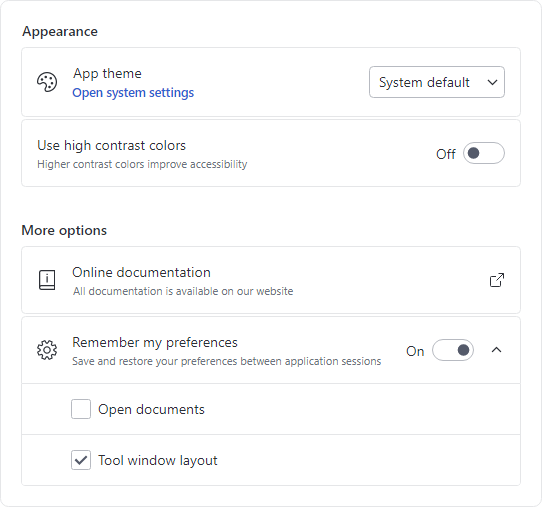
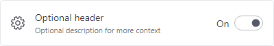
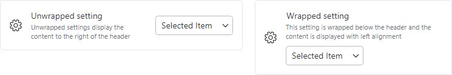

# SettingsCard

The [SettingsCard](xref:@ActiproUIRoot.Controls.SettingsCard), [SettingsExpander](settings-expander.md), and [SettingsGroup](settings-group.md) controls are used together to organize and present configurable settings.



*SettingsCard and SettingsExpander displayed within a SettingsGroup*

A [SettingsCard](xref:@ActiproUIRoot.Controls.SettingsCard) is typically used to display a single setting and is the primary control used when building a settings interface.



*SettingsCard with header, description, header icon, and ToggleSwitch content*

## Content Areas

The [SettingsCard](xref:@ActiproUIRoot.Controls.SettingsCard) control is defined by multiple content areas:

- [Header](xref:@ActiproUIRoot.Controls.SettingsCard.Header) - The primary label for the setting.
- [Description](xref:@ActiproUIRoot.Controls.SettingsCard.Description) - An additional description for the setting.
- [HeaderIcon](xref:@ActiproUIRoot.Controls.SettingsCard.HeaderIcon) - The primary icon for the setting.
- [ActionIcon](xref:@ActiproUIRoot.Controls.SettingsCard.HeaderIcon) - An icon displayed on the right side of the setting which is typically used to provide context for the action performed when a card is clicked.
- `Content` (Editor) - The control used to edit the setting (e.g., `ToggleSwitch`, `ComboBox`).

Each content area, including icons, can optionally be set to any value supported by `ContentPresenter` and the layout will adjust to only show the areas where content is defined.

> [!NOTE]
> In some scenarios, content may not be automatically detected. For instance, if a `DataTemplate` is used to define content without setting the corresponding content property, the control will not know that content is available.  Use the [IsHeaderVisible](xref:@ActiproUIRoot.Controls.SettingsCard.IsHeaderVisible), [IsDescriptionVisible](xref:@ActiproUIRoot.Controls.SettingsCard.IsDescriptionVisible), [IsHeaderIconVisible](xref:@ActiproUIRoot.Controls.SettingsCard.IsHeaderIconVisible), and [IsActionIconVisible](xref:@ActiproUIRoot.Controls.SettingsCard.IsActionIconVisible) properties to manually control the visibility of each content area.

> [!TIP]
> The [SettingsExpander](settings-expander.md) control has all the same content areas as [SettingsCard](xref:@ActiproUIRoot.Controls.SettingsCard) *except* [ActionIcon](xref:@ActiproUIRoot.Controls.SettingsCard.ActionIcon).

### Header and Description

The [Header](xref:@ActiproUIRoot.Controls.SettingsCard.Header) and [Description](xref:@ActiproUIRoot.Controls.SettingsCard.Description) are typically `string` values describing the setting, and both are optional.  The following demonstrates how to create a [SettingsCard](xref:@ActiproUIRoot.Controls.SettingsCard) with a header and description:

@if (avalonia) {
```xaml
xmlns:actipro="http://schemas.actiprosoftware.com/avaloniaui"
...
<actipro:SettingsCard Header="Setting name" Description="Use the description for additional context" ... />
```
}
@if (wpf) {
```xaml
xmlns:views="http://schemas.actiprosoftware.com/winfx/xaml/views"
...
<views:SettingsCard Header="Setting name" Description="Use the description for additional context" ... />
```
}

Since both properties can be set to any content supported by `ContentPresenter`, either property can be configured with more complex content.  The following example demonstrates how a hyperlink could be used as the [Description](xref:@ActiproUIRoot.Controls.SettingsCard.Description) @if (avalonia) { (using the [HyperlinkTextBlock](../../shared/controls/hyperlink-textblock.md) control) }:

@if (avalonia) {
```xaml
xmlns:actipro="http://schemas.actiprosoftware.com/avaloniaui"
...
<actipro:SettingsCard Header="Setting name">

	<actipro:SettingsCard.Description>
		<actipro:HyperlinkTextBlock Text="Click here for more"
			Command="{Binding SomeCommand}"
			FontSize="{actipro:ThemeResource DefaultFontSizeSmall}"
			FontWeight="DemiBold" />
	</actipro:SettingsCard.Description>

	...

</actipro:SettingsCard>
```
}
@if (wpf) {
```xaml
xmlns:views="http://schemas.actiprosoftware.com/winfx/xaml/views"
xmlns:themes="http://schemas.actiprosoftware.com/winfx/xaml/themes"
...
<views:SettingsCard Header="Setting name">

	<views:SettingsCard.Description>
		<TextBlock>
			<Hyperlink
				FontSize="{DynamicResource {x:Static themes:AssetResourceKeys.SmallFontSizeDoubleKey}}"
				FontWeight="DemiBold"
				Command="{Binding SomeCommand}"
				TextDecorations="None">
				Click here for more
			</Hyperlink>
		</TextBlock>
	</views:SettingsCard.Description>

	...

</views:SettingsCard>
```
}

### Icons

The [SettingsCard](xref:@ActiproUIRoot.Controls.SettingsCard) supports two icons:
- [HeaderIcon](xref:@ActiproUIRoot.Controls.SettingsCard.HeaderIcon) - An icon displayed on the left side of the card with a default size of `24x24`.  This icon is typically related to the value(s) defined by the setting.  For example, a speaker icon might be used for a setting related to output sound volume.
- [ActionIcon](xref:@ActiproUIRoot.Controls.SettingsCard.ActionIcon) - Typically used for cards with click enabled (see the "Enable Click" topic below), this icon is displayed on the right side of the card with a default size of `16x16`.  It is most often related to the action that will be performed if a card is clicked.  For example, if clicking a card opens a new window, an icon that represents opening an external window can help convey to the user what will happen if the card is clicked.

The following sample demonstrates two different techniques for defining either icon, but any content supported by `ContentPresenter` can be used to define the icons (like `Image` or @if (avalonia) { [DynamicImage](../../shared/controls/dynamic-image.md) }@if (wpf) { [DynamicImage](../../shared/windows-controls/dynamicimage.md) } controls):

@if (avalonia) {
```xaml
xmlns:actipro="http://schemas.actiprosoftware.com/avaloniaui"
...
<actipro:SettingsCard Header="Setting name" Command="{Binding SomeExternalWindowCommand}">

	<!-- Use a PathIcon as the primary icon -->
	<actipro:SettingsCard.HeaderIcon>
		<PathIcon Data="M19,13H5V11H19V13Z" />
	</actipro:SettingsCard.HeaderIcon>

	<!-- Use a built-in Actipro glyph template to indicate the setting opens an external window -->
	<actipro:SettingsCard.ActionIcon>
		<ContentPresenter ContentTemplate="{actipro:GlyphTemplate ExternalLink16}" />
	</actipro:SettingsCard.ActionIcon>

	...

</actipro:SettingsCard>
```
}
@if (wpf) {
```xaml
xmlns:views="http://schemas.actiprosoftware.com/winfx/xaml/views"
xmlns:themes="http://schemas.actiprosoftware.com/winfx/xaml/themes"
...
<views:SettingsCard Header="Setting name" Command="{Binding SomeExternalWindowCommand}">

	<!-- Use a Path as the primary icon -->
	<actipro:SettingsCard.HeaderIcon>
		<Viewbox Height="24" Width="24">
			<Path Data="M19,13H5V11H19V13Z" Fill="{Binding Path=(TextElement.Foreground), RelativeSource={RelativeSource Mode=Self}}" />
		</Viewbox>
	</actipro:SettingsCard.HeaderIcon>

	<!-- Use a built-in Actipro glyph template to indicate the setting opens an external window -->
	<actipro:SettingsCard.ActionIcon>
		<ContentPresenter ContentTemplate="{StaticResource {x:Static themes:SharedResourceKeys.ExternalWindowGlyphTemplateKey}}" />
	</actipro:SettingsCard.ActionIcon>

	...

</views:SettingsCard>
```
}

### Content (Editor)

The `Content` property (which is the default property for [SettingsCard](xref:@ActiproUIRoot.Controls.SettingsCard)) is used to present core control for the setting.  Any content supported by `ContentPresenter` can be used, but a setting is typically defined by common controls like `CheckBox`, `ComboBox`, `Slider`, and `ToggleSwitch`.

The following sections discuss some of the common scenarios for defining a setting using popular control types, but the card is not limited to these control types.

#### CheckBox Control

A `CheckBox` is often used when the card does not define its own [Header](xref:@ActiproUIRoot.Controls.SettingsCard.Header) and the label of the `CheckBox` is all that is needed.

The following demonstrates defining a [SettingsCard](xref:@ActiproUIRoot.Controls.SettingsCard) that uses a `CheckBox` without a header:

@if (avalonia) {
```xaml
xmlns:actipro="http://schemas.actiprosoftware.com/avaloniaui"
...
<actipro:SettingsCard ... >

	<CheckBox IsChecked="{Binding SomeProperty}" />

</actipro:SettingsCard>
```
}
@if (wpf) {
```xaml
xmlns:views="http://schemas.actiprosoftware.com/winfx/xaml/views"
...
<views:SettingsCard ... >

	<CheckBox IsChecked="{Binding SomeProperty}" />

</views:SettingsCard>
```
}

#### Slider Control

A `Slider` control is often used for selecting a value within a limited range.  Since a `Slider` does not typically define a minimum width, it is recommended to set the width explicitly.

The following demonstrates defining a [SettingsCard](xref:@ActiproUIRoot.Controls.SettingsCard) that uses a `Slider`:

@if (avalonia) {
```xaml
xmlns:actipro="http://schemas.actiprosoftware.com/avaloniaui"
...
<actipro:SettingsCard Header="Setting name" ... >

	<Slider Minimum="0" Maximum="100" MinWidth="150" Value="{Binding SomeProperty}" />

</actipro:SettingsCard>
```
}
@if (wpf) {
```xaml
xmlns:views="http://schemas.actiprosoftware.com/winfx/xaml/views"
...
<views:SettingsCard Header="Setting name" ... >

	<Slider Minimum="0" Maximum="100" MinWidth="150" Value="{Binding SomeProperty}" />

</views:SettingsCard>
```
}

#### TextBox Control

A `TextBox` control used for a setting is typically displayed full width.  This can be achieved by forcing the setting to wrap and using stretch alignment.  See the "Wrapping" section below for more details on wrapping.

The following demonstrates defining a [SettingsCard](xref:@ActiproUIRoot.Controls.SettingsCard) that uses a full-width `TextBox` control:

@if (avalonia) {
```xaml
xmlns:actipro="http://schemas.actiprosoftware.com/avaloniaui"
...
<actipro:SettingsCard Header="Setting name" IsWrapped="True" HorizontalContentAlignment="Stretch" ... >

	<TextBox Text="{Binding SomeProperty}" />

</actipro:SettingsCard>
```
}
@if (wpf) {
```xaml
xmlns:shared="http://schemas.actiprosoftware.com/winfx/xaml/shared"
xmlns:views="http://schemas.actiprosoftware.com/winfx/xaml/views"
...
<views:SettingsCard Header="Setting name" IsWrapped="True" HorizontalContentAlignment="Stretch" ... >

	<TextBox Text="{Binding SomeProperty}" />

</views:SettingsCard>
```
}

#### ToggleSwitch Control

A `ToggleSwitch` is a common control type for settings since the card's [Header](xref:@ActiproUIRoot.Controls.SettingsCard.Header) has already defined the setting and the `ToggleSwitch` can easily be used to turn the named setting on or off without any additional label being required for context.

@if (avalonia) {
When used for a setting, a `ToggleSwitch` tends to look best with the track on the right and the on/off content on the left.  When using Actipro Themes, set the [ThemeProperties](xref:@ActiproUIRoot.Themes.ThemeProperties).[ToggleSwitchHasFarAffinity](xref:@ActiproUIRoot.Themes.ThemeProperties.ToggleSwitchHasFarAffinityProperty) attached property to `true` for this layout.  See the [Theme Assets](../../themes/theme-assets.md) topic for more details on working with theme resources and how to globally change the default for all `ToggleSwitch` instances.
}

The following demonstrates defining a [SettingsCard](xref:@ActiproUIRoot.Controls.SettingsCard) that uses a `ToggleSwitch` control:

@if (avalonia) {
```xaml
xmlns:actipro="http://schemas.actiprosoftware.com/avaloniaui"
...
<actipro:SettingsCard Header="Setting name" ... >

	<ToggleSwitch actipro:ThemeProperties.ToggleSwitchHasFarAffinity="True" IsChecked="{Binding SomeProperty}" />

</actipro:SettingsCard>
```
}
@if (wpf) {
```xaml
xmlns:shared="http://schemas.actiprosoftware.com/winfx/xaml/shared"
xmlns:views="http://schemas.actiprosoftware.com/winfx/xaml/views"
...
<views:SettingsCard Header="Setting name" ... >

	<shared:ToggleSwitch IsChecked="{Binding SomeProperty}" />

</views:SettingsCard>
```
}


## Wrapping



*SettingsCard displayed in the unwrapped and wrapped states*

If enough space is available, the `Content` (Editor) of the setting is displayed to the right of the [Header](xref:@ActiproUIRoot.Controls.SettingsCard.Header) and/or [Description](xref:@ActiproUIRoot.Controls.SettingsCard.Description) with default right alignment.  When the width of the card is less than or equal to the [WrapThreshold](xref:@ActiproUIRoot.Controls.SettingsCard.WrapThreshold), the `Content` will be wrapped to the bottom of the card with default left alignment.

Use the [IsWrapped](xref:@ActiproUIRoot.Controls.SettingsCard.IsWrapped) property to manually control wrap behavior.  When set to `null` (the default), wrapping is based on the [WrapThreshold](xref:@ActiproUIRoot.Controls.SettingsCard.WrapThreshold). Set the property to `true` to force wrapping at any width, and `false` to prevent wrapping at any width.

> [!NOTE]
> Wrapping is only applicable if [Header](xref:@ActiproUIRoot.Controls.SettingsCard.Header) and/or [Description](xref:@ActiproUIRoot.Controls.SettingsCard.Description) are defined. Otherwise, the `Content` (Editor) will always be aligned left, by default.

## Enable Click

[SettingsCard](xref:@ActiproUIRoot.Controls.SettingsCard) derives from `Button`, so it supports the same `Command` model and `Click` event as `Button`.  Unlike a `Button`, though, not all instances of [SettingsCard](xref:@ActiproUIRoot.Controls.SettingsCard) will need to support being clicked and the control has been configured to not be clickable by default.

Set the [IsClickEnabled](xref:@ActiproUIRoot.Controls.SettingsCard.IsClickEnabled) property to `true` to enable clicking the card.  The `Click` event will not be raised if this property is `false`.

> [!TIP]
> If the `Command` property is assigned a non-`null` value, the [IsClickEnabled](xref:@ActiproUIRoot.Controls.SettingsCard.IsClickEnabled) property is automatically coerced to `true`, so no additional configuration is necessary.

> [!WARNING]
> The `Click` event can bubble up from other controls hosted on a [SettingsCard](xref:@ActiproUIRoot.Controls.SettingsCard), so always verify the source of the `Click` event before responding.  For example, if a [SettingsCard](xref:@ActiproUIRoot.Controls.SettingsCard) is configured with a `CheckBox` as the content, clicking the `CheckBox` will toggle the value *and* raise the `Click` event.

The following code sample demonstrates how a [SettingsCard](xref:@ActiproUIRoot.Controls.SettingsCard) can be configured to handle the `Click` event in XAML with the corresponding code-behind logic:

@if (avalonia) {
```xaml
xmlns:actipro="http://schemas.actiprosoftware.com/avaloniaui"
...
<actipro:SettingsCard IsClickEnabled="True" Click="OnSettingClick" ... />
```
}
@if (wpf) {
```xaml
xmlns:views="http://schemas.actiprosoftware.com/winfx/xaml/views"
...
<views:SettingsCard IsClickEnabled="True" Click="OnSettingClick" ... />
```
}
```csharp
// Code behind
...
private void OnSettingClick(object sender, RoutedEventArgs e) {
	// Make sure the source of the Click is a SettingsCard since some Click
	// events can bubble up from content hosted on the card (like a CheckBox)
	if ((e.Source is SettingsCard) && (!e.Handled)) {
		// Respond to click here
	}
}
```

## Indentation

Not all settings will have a [HeaderIcon](xref:@ActiproUIRoot.Controls.SettingsCard.HeaderIcon) or [ActionIcon](xref:@ActiproUIRoot.Controls.SettingsCard.ActionIcon).  When multiple settings are stacked vertically, it may be desirable to have consistent horizontal alignment of all the content areas within the individual settings.  By setting [IsHeaderIconVisible](xref:@ActiproUIRoot.Controls.SettingsCard.IsHeaderIconVisible) and/or [IsActionIconVisible](xref:@ActiproUIRoot.Controls.SettingsCard.IsActionIconVisible) to `true`, the layout will reserve space for these elements even when a corresponding icon is not available.  This results in all the settings having a consistent layout.

@if (avalonia) {

## Pseudo-classes

The following pseudo-classes are available and can be used when styling the control:

| Class | Description |
| ----- | ----- |
| `:wrapped` | Added when the `Content` (Editor) has wrapped due to the available width being less than or equal to the [WrapThreshold](xref:@ActiproUIRoot.Controls.SettingsCard.WrapThreshold) or when [IsWrapped](xref:@ActiproUIRoot.Controls.SettingsCard.IsWrapped) is set to `true`. |

}

@if (avalonia) {
## Theme Resources

The following theme resources are available for customizing the appearance of the control:

| Theme Resource | Description |
| ----- | ----- |
| [Container1BackgroundBrush](xref:@ActiproUIRoot.Themes.ThemeResourceKind.Container1BackgroundBrush) | The default `Background`. |
| [Container2BackgroundBrush](xref:@ActiproUIRoot.Themes.ThemeResourceKind.Container1BackgroundBrush) | The default `Background` of a clickable card when the mouse is over the control. |
| [Container3BackgroundBrush](xref:@ActiproUIRoot.Themes.ThemeResourceKind.Container1BackgroundBrush) | The default `Background` of a clickable card when the control is pressed. |
| [Container1BorderBrush](xref:@ActiproUIRoot.Themes.ThemeResourceKind.Container1BorderBrush) | The default `BorderBrush`. |
| [Container2BorderBrush](xref:@ActiproUIRoot.Themes.ThemeResourceKind.Container1BorderBrush) | The default `BorderBrush` of a clickable card when the mouse is over the control. |
| [Container3BorderBrush](xref:@ActiproUIRoot.Themes.ThemeResourceKind.Container1BorderBrush) | The default `BorderBrush` of a clickable card when the control is pressed. |
| [SettingsCardBorderThickness](xref:@ActiproUIRoot.Themes.ThemeResourceKind.SettingsCardBorderThickness) | The default `BorderThickness`. |
| [SettingsCardCornerRadius](xref:@ActiproUIRoot.Themes.ThemeResourceKind.SettingsCardCornerRadius) | The default `CornerRadius`. |
| [DefaultFontSizeExtraSmall](xref:@ActiproUIRoot.Themes.ThemeResourceKind.DefaultFontSizeExtraSmall) | The default `FontSize` of the [Description](xref:@ActiproUIRoot.Controls.SettingsCard.Description) content.
| [DefaultForegroundBrush](xref:@ActiproUIRoot.Themes.ThemeResourceKind.DefaultForegroundBrush) | The default `Foreground`. |
| [DefaultForegroundBrushTertiary](xref:@ActiproUIRoot.Themes.ThemeResourceKind.DefaultForegroundBrushTertiary) | The default `Foreground` of the [Description](xref:@ActiproUIRoot.Controls.SettingsCard.Description) content. |
| [DefaultForegroundBrushDisabled](xref:@ActiproUIRoot.Themes.ThemeResourceKind.DefaultForegroundBrushDisabled) | The default `Foreground` when the control is disabled. |
| [SettingsCardPadding](xref:@ActiproUIRoot.Themes.ThemeResourceKind.SettingsCardPadding) | The default `Padding`. |
| [SettingsCardActionIconLength](xref:@ActiproUIRoot.Themes.ThemeResourceKind.SettingsCardActionIconLength) | The default `Width` and `Height` of the [ActionIcon](xref:@ActiproUIRoot.Controls.SettingsCard.ActionIcon). |
| [SettingsCardHeaderIconLength](xref:@ActiproUIRoot.Themes.ThemeResourceKind.SettingsCardHeaderIconLength) | The default `Width` and `Height` of the [HeaderIcon](xref:@ActiproUIRoot.Controls.SettingsCard.HeaderIcon). |
| [SettingsCardWrapThreshold](xref:@ActiproUIRoot.Themes.ThemeResourceKind.SettingsCardWrapThreshold) | The default [WrapThreshold](xref:@ActiproUIRoot.Controls.SettingsCard.WrapThreshold). |

See the [Theme Assets](../../themes/theme-assets.md) topic for more details on working with theme resources.
}
@if (wpf) {
## Theme Assets

See the [Theme Reusable Assets](../../themes/reusable-assets.md) topic for more details on using and customizing theme assets.  The following reusable assets are used by [SettingsCard](xref:@ActiproUIRoot.Controls.Views.SettingsCard):

| Asset Resource Key | Description |
|-----|-----|
| [ContainerBackgroundLowestBrushKey](xref:@ActiproUIRoot.Themes.AssetResourceKeys.ContainerBackgroundLowestBrushKey) | The default `Background`. |
| [ContainerBackgroundLowerBrushKey](xref:@ActiproUIRoot.Themes.AssetResourceKeys.ContainerBackgroundLowerBrushKey) | The default `Background` of a clickable card when the mouse is over the control. |
| [ContainerBackgroundLowBrushKey](xref:@ActiproUIRoot.Themes.AssetResourceKeys.ContainerBackgroundLowBrushKey) | The default `Background` of a clickable card when the control is pressed. |
| [ContainerBorderLowerBrushKey](xref:@ActiproUIRoot.Themes.AssetResourceKeys.ContainerBorderLowerBrushKey) | The default `BorderBrush`. |
| [ContainerBorderLowBrushKey](xref:@ActiproUIRoot.Themes.AssetResourceKeys.ContainerBorderLowBrushKey) | The default `BorderBrush` of a clickable card when the mouse is over the control. |
| [ContainerBorderMidLowBrushKey](xref:@ActiproUIRoot.Themes.AssetResourceKeys.ContainerBorderMidLowBrushKey) | The default `BorderBrush` of a clickable card when the control is pressed. |
| [SettingsCardBorderNormalThicknessKey](xref:@ActiproUIRoot.Themes.AssetResourceKeys.SettingsCardBorderNormalThicknessKey) | The default `BorderThickness`. |
| [SettingsCardBorderNormalCornerRadiusKey](xref:@ActiproUIRoot.Themes.AssetResourceKeys.SettingsCardBorderNormalCornerRadiusKey) | The default [CornerRadius](xref:@ActiproUIRoot.Controls.Views.SettingsCard.CornerRadius).
| [SmallFontSizeDoubleKey](xref:@ActiproUIRoot.Themes.AssetResourceKeys.SmallFontSizeDoubleKey) | The default `FontSize` of the [Description](xref:@ActiproUIRoot.Controls.Views.SettingsCard.Description) content.
| [ContainerForegroundLowestNormalBrushKey](xref:@ActiproUIRoot.Themes.AssetResourceKeys.ContainerForegroundLowestNormalBrushKey) | The default `Foreground`. |
| [ContainerForegroundLowestSubtleBrushKey](xref:@ActiproUIRoot.Themes.AssetResourceKeys.ContainerForegroundLowestSubtleBrushKey) | The default `Foreground` of the [Description](xref:@ActiproUIRoot.Controls.Views.SettingsCard.Description) content. |
| [ContainerForegroundLowestDisabledBrushKey](xref:@ActiproUIRoot.Themes.AssetResourceKeys.ContainerForegroundLowestDisabledBrushKey) | The default `Foreground` when the control is disabled. |
| [SettingsCardPaddingNormalThicknessKey](xref:@ActiproUIRoot.Themes.AssetResourceKeys.SettingsCardPaddingNormalThicknessKey) | The default `Padding`.
| [SettingsCardActionIconLengthDoubleKey](xref:@ActiproUIRoot.Themes.AssetResourceKeys.SettingsCardActionIconLengthDoubleKey) | The default `Width` and `Height` of the [ActionIcon](xref:@ActiproUIRoot.Controls.Views.SettingsCard.ActionIcon).
| [SettingsCardHeaderIconLengthDoubleKey](xref:@ActiproUIRoot.Themes.AssetResourceKeys.SettingsCardHeaderIconLengthDoubleKey) | The default `Width` and `Height` of the [HeaderIcon](xref:@ActiproUIRoot.Controls.Views.SettingsCard.HeaderIcon).
| [SettingsCardWrapThresholdDoubleKey](xref:@ActiproUIRoot.Themes.AssetResourceKeys.SettingsCardWrapThresholdDoubleKey) | The default [WrapThreshold](xref:@ActiproUIRoot.Controls.Views.SettingsCard.WrapThreshold).
}