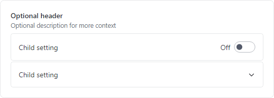
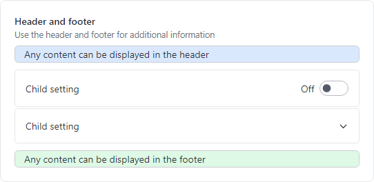

# SettingsGroup

The [SettingsCard](settings-card.md), [SettingsExpander](settings-expander.md), and [SettingsGroup](xref:@ActiproUIRoot.Controls.SettingsGroup) controls are used together to organize and present configurable settings.


*SettingsCard and SettingsExpander displayed within a SettingsGroup*

A [SettingsGroup](xref:@ActiproUIRoot.Controls.SettingsGroup) is used to organize one or more [SettingsCard](settings-card.md) or [SettingsExpander](settings-expander.md) instances under an optional header.



*SettingsGroup with optional header and description displaying a SettingsCard and SettingsExpander as child settings*

## Primary Content Areas

The [SettingsGroup](xref:@ActiproUIRoot.Controls.SettingsGroup) control is defined by multiple content areas:

- [Header](xref:@ActiproUIRoot.Controls.SettingsGroup.Header) - The primary label for the group.
- [Description](xref:@ActiproUIRoot.Controls.SettingsGroup.Description) - An additional description for the group.

Each content area can optionally be set to any value supported by `ContentPresenter` and the layout will adjust to only show the areas where content is defined.

> [!NOTE]
> In some scenarios, content may not be automatically detected. For instance, if a `DataTemplate` is used to define content without setting the corresponding content property, the control will not know that content is available.  Use the [IsHeaderVisible](xref:@ActiproUIRoot.Controls.SettingsGroup.IsHeaderVisible) and [IsDescriptionVisible](xref:@ActiproUIRoot.Controls.SettingsGroup.IsDescriptionVisible) properties to manually control the visibility of each content area.

### Header and Description

The [Header](xref:@ActiproUIRoot.Controls.SettingsGroup.Header) and [Description](xref:@ActiproUIRoot.Controls.SettingsGroup.Description) are typically `string` values describing the group, and both are optional.  The following demonstrates how to create a [SettingsGroup](xref:@ActiproUIRoot.Controls.SettingsGroup) with a header and description:

@if (avalonia) {
```xaml
xmlns:actipro="http://schemas.actiprosoftware.com/avaloniaui"
...
<actipro:SettingsGroup Header="Group name" Description="Use the description for additional context">

	<!-- Define child settings here -->

</actipro:SettingsGroup>
```
}
@if (wpf) {
```xaml
xmlns:views="http://schemas.actiprosoftware.com/winfx/xaml/views"
...
<views:SettingsGroup Header="Group name" Description="Use the description for additional context">

	<!-- Define child settings here -->

</views:SettingsGroup>
```
}

## Items (Child Settings)

The [SettingsGroup](xref:@ActiproUIRoot.Controls.SettingsGroup) is an `ItemsControl` that supports defining one or more [SettingsCard](settings-card.md) or [SettingsExpander](settings-expander.md) instances as child settings that displayed within the group.

The following sample demonstrates defining a [SettingsGroup](xref:@ActiproUIRoot.Controls.SettingsGroup) with multiple child settings:

@if (avalonia) {
```xaml
xmlns:actipro="http://schemas.actiprosoftware.com/avaloniaui"
...
<actipro:SettingsGroup Header="Group name" ... >

	<actipro:SettingsCard Header="Child setting">
		<ComboBox> ... </ComboBox>
	</actipro:SettingsCard>

	<actipro:SettingsExpander Header="Child setting">

		<actipro:SettingsCard Header="Expander child setting">
			<ToggleSwitch actipro:ThemeProperties.ToggleSwitchHasFarAffinity="True" />
		</actipro:SettingsCard>

	</actipro:SettingsExpander>

</actipro:SettingsGroup>
```
}
@if (wpf) {
```xaml
xmlns:shared="http://schemas.actiprosoftware.com/winfx/xaml/shared"
xmlns:views="http://schemas.actiprosoftware.com/winfx/xaml/views"
...
<views:SettingsExpanderHeader="Setting name" IsExpanded="True" ... >

	<views:SettingsCard Header="Child setting">
		<ComboBox> ... </ComboBox>
	</views:SettingsCard>

	<views:SettingsCard Header="Child setting">
		<shared:ToggleSwitch />
	</views:SettingsCard>

</views:SettingsExpander>
```
}

See the [SettingsCard](settings-card.md) and [SettingsExpander](settings-expander.md) topics for more details.

### Spacing

Each [SettingsCard](settings-card.md) or [SettingsExpander](settings-expander.md) within a group is automatically spaced out to improve visibility. Use the [Spacing](xref:@ActiproUIRoot.Controls.SettingsGroup.Spacing) property to change the amount of spacing between each item.

## Items Header and Footer



*SettingsGroup showing ItemsHeader and ItemsFooter*

[SettingsGroup](xref:@ActiproUIRoot.Controls.SettingsGroup) allows for additional content to be displayed above and below the child settings.  Any content supported by `ContentPresenter` can be defined in the [ItemsHeader](xref:@ActiproUIRoot.Controls.SettingsGroup.ItemsHeader) or [ItemsFooter](xref:@ActiproUIRoot.Controls.SettingsGroup.ItemsFooter).

The following sample demonstrates adding an informational message in the [ItemsHeader](xref:@ActiproUIRoot.Controls.SettingsGroup.ItemsHeader):

@if (avalonia) {
```xaml
xmlns:actipro="http://schemas.actiprosoftware.com/avaloniaui"
...
<actipro:SettingsGroup Header="Group name" ... >

	<actipro:SettingsGroup.ItemsHeader>
		<Border Background="{actipro:ThemeResource Container3BackgroundBrush}"
				BorderBrush="{actipro:ThemeResource Container3BorderBrush}"
				BorderThickness="1" Padding="12,2" CornerRadius="5"
				Margin="0,0,0,10">
			<TextBlock TextWrapping="Wrap">Any content can be displayed in the header</TextBlock>
		</Border>
	</actipro:SettingsGroup.ItemsHeader>

	<!-- Define child settings here -->

</actipro:SettingsGroup>
```
}
@if (wpf) {
```xaml
xmlns:views="http://schemas.actiprosoftware.com/winfx/xaml/views"
...
<views:SettingsGroupHeader="Setting name" ... >

	<views:SettingsGroup.ItemsHeader>
		<Border Background="{DynamicResource {x:Static themes:AssetResourceKeys.ColorPaletteBlueBackgroundLowestBrushKey}}"
			BorderBrush="{DynamicResource {x:Static themes:AssetResourceKeys.ContainerBorderLowBrushKey}}" BorderThickness="1"
			CornerRadius="5" Padding="7" Margin="0,0,0,2">

			<TextBlock>Any content can be displayed above the child settings</TextBlock>
		</Border>
	</views:SettingsGroup.ItemsHeader>

	<!-- Define child settings here -->

</views:SettingsGroup>
```
}

> [!NOTE]
> In some scenarios, content may not be automatically detected. For instance, if a `DataTemplate` is used to define content without setting the corresponding content property, the control will not know that content is available.  Use the [IsItemsHeaderVisible](xref:@ActiproUIRoot.Controls.SettingsGroup.IsItemsHeaderVisible) and [IsItemsFooterVisible](xref:@ActiproUIRoot.Controls.SettingsGroup.IsItemsHeaderVisible) properties to manually control the visibility of each content area.

## StackPanel and Margin

The [SettingsGroup](xref:@ActiproUIRoot.Controls.SettingsGroup) is designed to be stacked vertically within a `StackPanel` with minimal effort. As part of this design, each [SettingsGroup](xref:@ActiproUIRoot.Controls.SettingsGroup) has a default `Margin` applied which includes spacing on the bottom. This will consistently separate one group from the group below it but does introduce extra spacing below the last item in a `StackPanel`.  For many common layouts, this extra spacing may be inconsequential.  If necessary, explicitly set the `Margin` of the last group to `0` to avoid the spacing.

The following sample demonstrates a common layout for defining multiple groups:

@if (avalonia) {
```xaml
xmlns:actipro="http://schemas.actiprosoftware.com/avaloniaui"
...
<StackPanel>

	<actipro:SettingsGroup Header="Group 1">
		...
	</actipro:SettingsGroup>

	<actipro:SettingsGroup Header="Group 2">
		...
	</actipro:SettingsGroup>

	<actipro:SettingsGroup Header="Group 3" Margin="0">
		...
	</actipro:SettingsGroup>

</StackPanel>
```
}
@if (wpf) {
```xaml
xmlns:views="http://schemas.actiprosoftware.com/winfx/xaml/views"
...
<StackPanel>

	<views:SettingsGroup Header="Group 1">
		...
	</views:SettingsGroup>

	<views:SettingsGroup Header="Group 2">
		...
	</views:SettingsGroup>

	<views:SettingsGroup Header="Group 3" Margin="0">
		...
	</views:SettingsGroup>

</StackPanel>
```
}


@if (avalonia) {
## Theme Resources

The following theme resources are available for customizing the appearance of the control:

| Theme Resource | Description |
| ----- | ----- |
| [HeadingFontFamily](xref:@ActiproUIRoot.Themes.ThemeResourceKind.HeadingFontFamily) | The default `FontFamily` for the [Header](xref:@ActiproUIRoot.Controls.SettingsGroup.Header) content.
| [HeadingFontSizeExtraSmall](xref:@ActiproUIRoot.Themes.ThemeResourceKind.HeadingFontSizeExtraSmall) | The default `FontSize` for the [Header](xref:@ActiproUIRoot.Controls.SettingsGroup.Header) content.
| [DefaultFontSizeSmall](xref:@ActiproUIRoot.Themes.ThemeResourceKind.DefaultFontSizeSmall) | The default `FontSize` for the [Description](xref:@ActiproUIRoot.Controls.SettingsGroup.Description) content.
| [HeadingFontWeightExtraSmall](xref:@ActiproUIRoot.Themes.ThemeResourceKind.HeadingFontWeightExtraSmall) | The default `FontWeight` for the [Header](xref:@ActiproUIRoot.Controls.SettingsGroup.Header) content.
| [DefaultForegroundBrush](xref:@ActiproUIRoot.Themes.ThemeResourceKind.DefaultForegroundBrush) | The default `Foreground`. |
| [DefaultForegroundBrushTertiary](xref:@ActiproUIRoot.Themes.ThemeResourceKind.DefaultForegroundBrushTertiary) | The default `Foreground` of the [Description](xref:@ActiproUIRoot.Controls.SettingsGroup.Description) content. |
| [DefaultForegroundBrushDisabled](xref:@ActiproUIRoot.Themes.ThemeResourceKind.DefaultForegroundBrushDisabled) | The default `Foreground` when the control is disabled. |
| [SettingsGroupMargin](xref:@ActiproUIRoot.Themes.ThemeResourceKind.SettingsGroupMargin) | The default `Margin`. |
| [SettingsGroupPadding](xref:@ActiproUIRoot.Themes.ThemeResourceKind.SettingsGroupPadding) | The default `Padding`. |
| [SettingsGroupSpacing](xref:@ActiproUIRoot.Themes.ThemeResourceKind.SettingsGroupSpacing) | The default [Spacing](xref:@ActiproUIRoot.Controls.SettingsGroup.Spacing). |

See the [Theme Assets](../../themes/theme-assets.md) topic for more details on working with theme resources.
}
@if (wpf) {
## Theme Assets

See the [Theme Reusable Assets](../../themes/reusable-assets.md) topic for more details on using and customizing theme assets.  The following reusable assets are used by [SettingsGroup](xref:@ActiproUIRoot.Controls.Views.SettingsGroup):

| Asset Resource Key | Description |
|-----|-----|
| [ContainerForegroundLowestNormalBrushKey](xref:@ActiproUIRoot.Themes.AssetResourceKeys.ContainerForegroundLowestNormalBrushKey) | The default `Foreground`. |
| [ContainerForegroundLowestSubtleBrushKey](xref:@ActiproUIRoot.Themes.AssetResourceKeys.ContainerForegroundLowestSubtleBrushKey) | The default `Foreground` of the [Description](xref:@ActiproUIRoot.Controls.Views.SettingsGroup.Description) content. |
| [ContainerForegroundLowestDisabledBrushKey](xref:@ActiproUIRoot.Themes.AssetResourceKeys.ContainerForegroundLowestDisabledBrushKey) | The default `Foreground` when the control is disabled. |
| [SettingsGroupMarginNormalThicknessKey](xref:@ActiproUIRoot.Themes.AssetResourceKeys.SettingsGroupMarginNormalThicknessKey) | The default `Margin`. |
| [SettingsGroupPaddingNormalThicknessKey](xref:@ActiproUIRoot.Themes.AssetResourceKeys.SettingsGroupPaddingNormalThicknessKey) | The default `Padding`. |
| [SettingsGroupSpacingDoubleKey](xref:@ActiproUIRoot.Themes.AssetResourceKeys.SettingsGroupSpacingDoubleKey) | The default [Spacing](xref:@ActiproUIRoot.Controls.Views.SettingsGroup.Spacing). |
}