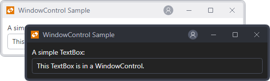

# WindowControl

[WindowControl](xref:@ActiproUIRoot.Controls.WindowControl) is a control that looks and acts like a `Window`, but can be used anywhere a `Control` can be used.  This is especially useful when developing single-page applications that need `Window`-like capabilities.



*A WindowControl displayed in light and dark theme variants*
}


[WindowControl](xref:@ActiproUIRoot.Controls.WindowControl) is a `Control` that implements most of the same members as the standard @@PlatformName `Window` class.

> [!IMPORTANT]
> See the [Getting Started](../getting-started.md) topic for details on configuring themes for this control.

## What Can I Do with WindowControl?

Unlike a normal `Window`, [WindowControl](xref:@ActiproUIRoot.Controls.WindowControl) can be put in any control hierarchy.  It also supports complete templating and can be animated.

## Restrictions

Since [WindowControl](xref:@ActiproUIRoot.Controls.WindowControl) is a `Control` it still must be contained by a root `TopLevel`.

## Working with the WindowControl

As mentioned above we implemented many of the same members found in a @@PlatformName `Window` within [WindowControl](xref:@ActiproUIRoot.Controls.WindowControl).  You can set properties such as [WindowState](xref:@ActiproUIRoot.Controls.WindowControl.WindowState) or [CanResize](xref:@ActiproUIRoot.Controls.WindowControl.CanResize).  Browse through the members list on the [WindowControl](xref:@ActiproUIRoot.Controls.WindowControl) control to see what is available to you.

There are also a number of extra properties, methods, and events that aren't on `Window`, such as the [ToggleWindowState](xref:@ActiproUIRoot.Controls.WindowControl.ToggleWindowState*) method, the [TitleBarMenuOpening](xref:@ActiproUIRoot.Controls.WindowControl.TitleBarMenuOpening) event, etc.

Title bar drags and border resize operations will cause the control's `Left`, `Top`, `Width`, and `Height` properties to be altered.  To support drag operations visually, place the [WindowControl](xref:@ActiproUIRoot.Controls.WindowControl) in a `Canvas` and bind the `Canvas.Left` attached property to the `WindowControl.Left` property, and `Canvas.Top` attached property to the `WindowControl.Top` property.

```xaml
xmlns:actipro="http://schemas.actiprosoftware.com/avaloniaui"
...
<Canvas>
	<actipro:WindowControl ...
		Canvas.Left="{Binding $self.Left, Mode=OneWay}"
		Canvas.Top="{Binding $self.Top, Mode=OneWay}">

		...

	</actipro:WindowControl>
</Canvas>
```

## Managing the Title Bar

The title bar can be hidden entirely by setting [HasTitleBar](xref:@ActiproUIRoot.Controls.WindowControl.HasTitleBar) to `false`.  Alternatively, the buttons, icon, and text displayed by the title bar can be customized as described below.

### Buttons

A number of properties can be used to alter the state or visibility of the title bar buttons.  By default, the current window state governs which of the minimize, restore, and maximize buttons are visible.

The [CanClose](xref:@ActiproUIRoot.Controls.WindowControl.CanClose) property indicates if the **Close** button is enabled.

Sometimes it is useful to be able to always force one or more of the buttons to be hidden.  One use case is where you don't wish to allow minimization of the window and never want the **Minimize** button visible.  The [IsMinimizeButtonAllowed](xref:@ActiproUIRoot.Controls.WindowControl.IsMinimizeButtonAllowed), [IsRestoreButtonAllowed](xref:@ActiproUIRoot.Controls.WindowControl.IsRestoreButtonAllowed), [IsMaximizeButtonAllowed](xref:@ActiproUIRoot.Controls.WindowControl.IsMaximizeButtonAllowed), and [IsCloseButtonAllowed](xref:@ActiproUIRoot.Controls.WindowControl.IsCloseButtonAllowed) properties can be set to `false` to specify that their related button should never be visible.

### Icon

An icon can be displayed by setting [WindowControl](xref:@ActiproUIRoot.Controls.WindowControl).[Icon](xref:@ActiproUIRoot.Controls.WindowControl.Icon) to an object that defines an icon.  By default, the icon is displayed when an non-`null` icon is specified.  You can alter this behavior by explicitly setting [WindowControl](xref:@ActiproUIRoot.Controls.WindowControl).[IsIconVisible](xref:@ActiproUIRoot.Controls.WindowControl.IsIconVisible).  Therefore, you can force the [WindowControl](xref:@ActiproUIRoot.Controls.WindowControl) to hide an icon by setting [IsIconVisible](xref:@ActiproUIRoot.Controls.WindowControl.IsIconVisible) to `false`.

Any content supported by [Icon Presenter](../../themes/icon-presenter.md) can be used to define the icons (like `IImage` data, `PathIcon` control, or [DynamicImage](../../shared/controls/dynamic-image.md) control).

### Custom Title Bar Content

Additional content can be added to the title bar by setting a custom [WindowControl](xref:@ActiproUIRoot.Controls.WindowControl).[TitleBarTheme](xref:@ActiproUIRoot.Controls.WindowControl.TitleBarTheme).  The following demonstrates how to add an [Avatar](avatar.md) control to the right content of the title bar:

```xaml
xmlns:actipro="http://schemas.actiprosoftware.com/avaloniaui"
...
<actipro:WindowControl ... >

	<actipro:WindowControl.TitleBarTheme>
		<ControlTheme TargetType="actiproPrimitives:ChromedTitleBar" BasedOn="{actipro:ControlTheme WindowControlTitleBar}">
			<Setter Property="RightContentTemplate">
				<DataTemplate>

					<!-- Avatar -->
					<actipro:Avatar Width="20" Margin="10,0" />

				</DataTemplate>
			</Setter>
		</ControlTheme>
	</actipro:WindowControl.TitleBarTheme>

	...

</actipro:WindowControl>
```

Refer to the [ChromedTitleBar](../../shared/controls/chromed-title-bar.md) topic for more details about title bar capabilities.
