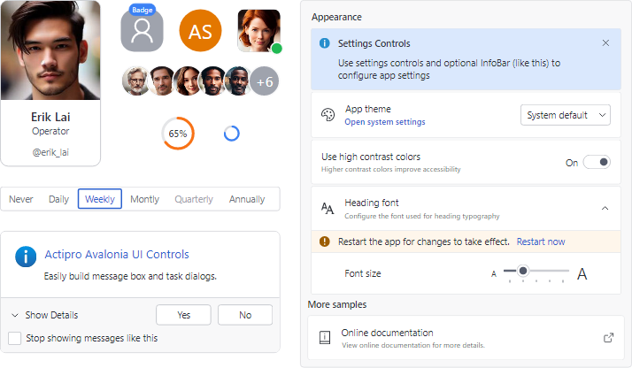

# Overview

Actipro Fundamentals is a library that contains professionally-developed controls and components for building high-quality applications.

*Various controls in the Fundamentals library*

> [!IMPORTANT]
> The Actipro Fundamentals is a paid product!  See our [Licensing](../licensing.md) topic for more details.

## Features

### General Controls

- An [Avatar](controls/avatar.md) to represent people or objects.
- An [Avatar Group](controls/avatar-group.md) renders multiple [Avatar](controls/avatar.md) controls.
- A [Badge](controls/badge.md) for displaying contextual information for other elements or can be used stand-alone.
- A [RingSpinner](controls/progress-spinners.md) control that is a circular busy indicator.
- A [User Prompt](user-prompt/index.md) for displaying **MessageBox** and **Task Dialog** style prompts.

### Panels

- A [MultiColumnPanel](xref:@ActiproUIRoot.Controls.MultiColumnPanel) that can arrange child elements in multiple columns, collapsing columns down as available space decreases.