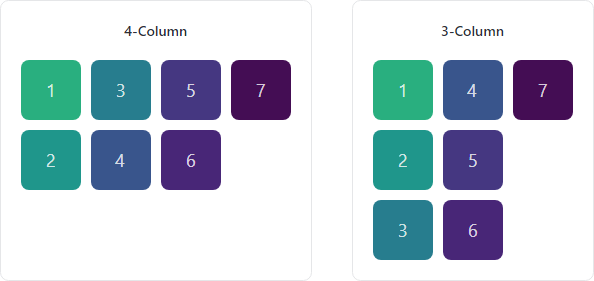

# Multi-Column Panel

[MultiColumnPanel](xref:@ActiproUIRoot.Controls.MultiColumnPanel) provides an implementation of a `Panel` that can arrange child elements in multiple columns, collapsing columns down as available space decreases.



*MultiColumnPanel showing layout change from four columns to three*

@if (avalonia) {
> [!IMPORTANT]
> See the [Getting Started](../getting-started.md) topic for details on configuring themes for this control.
}

## Overview

Items are stacked vertically within columns.  When the panel is wide enough to support an additional column, items in the collection will be wrapped from the bottom of the previous column to the top of the next column.

As the available size changes, items are rearranged to fit within the number of columns allowed by the available space.

## Column Definitions

The [MaxColumnCount](xref:@ActiproUIRoot.Controls.MultiColumnPanel.MaxColumnCount) property limits how many columns are supported.

When [CanRemoveEmptyColumns](xref:@ActiproUIRoot.Controls.MultiColumnPanel.CanRemoveEmptyColumns) is `false` (the default value), space is reserved for the maximum number of columns even if there are not enough items to fill all of them.  Set [CanRemoveEmptyColumns](xref:@ActiproUIRoot.Controls.MultiColumnPanel.CanRemoveEmptyColumns) to `true` to remove the space allocated to columns that will be empty at the current size.

The [MinColumnWidth](xref:@ActiproUIRoot.Controls.MultiColumnPanel.MinColumnWidth) property can be used to set a minimum width of all columns.

## Spacing

Use the [VerticalSpacing](xref:@ActiproUIRoot.Controls.MultiColumnPanel.VerticalSpacing) property to define the vertical spacing between items in the same column.

Use the [HorizontalSpacing](xref:@ActiproUIRoot.Controls.MultiColumnPanel.HorizontalSpacing) property to define the horizontal spacing between each column.

## ItemsPanel Usage

[MultiColumnPanel](xref:@ActiproUIRoot.Controls.MultiColumnPanel) can be used as the `ItemsPanel` for any `ItemsControl` as shown in the following example:

```xaml
xmlns:actipro="http://schemas.actiprosoftware.com/avaloniaui"
...

<ItemsControl ... >

	<!-- Replace the default panel with MultiColumnPanel -->
	<ItemsControl.ItemsPanel>
		<ItemsPanelTemplate>
			<actipro:MultiColumnPanel
				MaxColumnCount="3"
				MinColumnWidth="250"
				HorizontalSpacing="50"
				VerticalSpacing="20"
				CanRemoveEmptyColumns="True" />
		</ItemsPanelTemplate>
	</ItemsControl.ItemsPanel>

	<ItemsControl.ItemTemplate>
		<DataTemplate>
			<!-- Define item template content here -->
		</DataTemplate>
	</ItemsControl.ItemTemplate>

</ItemsControl>
```