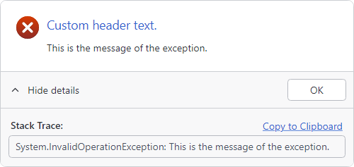

# Extension Methods

One of the benefits of the [builder pattern](builder-pattern.md) is that it's easy to extend the builder class with extension methods.

@if (avalonia) {
> [!IMPORTANT]
> Import the `ActiproSoftware.UI.Avalonia.Controls` namespace to include the built-in extension methods.
}
@if (wpf) {
> [!IMPORTANT]
> Import the `ActiproSoftware.Windows.Extensions` namespace to include the built-in extension methods.
}

## Exception Prompt

A common scenario in application development is to catch an `Exception` and prompt the user that an error occurred.

@if (avalonia) {

}
@if (wpf) {

}

*UserPromptControl configured to display details of an exception with stack trace expanded*

The @if (avalonia) { [ForException](xref:@ActiproUIRoot.Controls.UserPromptExtensions.ForException*) }@if (wpf) { [ForException](xref:@ActiproUIRoot.Extensions.UserPromptExtensions.ForException*) } extension method can be used to pre-configure the [UserPromptBuilder](xref:@ActiproUIRoot.Controls.UserPromptBuilder) to display an exception.  This includes the error status image, a summary of the error, and a detailed stack trace in the expanded information with a link to copy the stack trace to the clipboard.

The following sample demonstrates how easily a rich exception prompt can be created and shown to the user:

@if (avalonia) {
```csharp
try {
	//
}
catch (Exception ex) {
	await UserPromptBuilder.Configure()
		.ForException(ex, "Custom header text.")
		.Show();
}
```
}
@if (wpf) {
```csharp
try {
	//
}
catch (Exception ex) {
	UserPromptBuilder.Configure()
		.ForException(ex, "Custom header text.")
		.Show();
}
```
}

> [!TIP]
> See the [Localization](localization.md) topic for details on how to customize the string resources used for exception prompt.