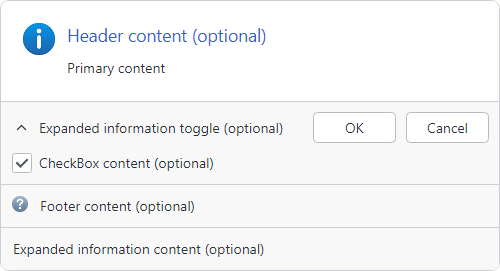

# Overview

**User Prompt** provides a modern replacement for traditional **MessageBox** or **Task Dialog** functionality.

@if (avalonia) {

}
@if (wpf) {

}

*UserPromptControl with optional content areas labeled, OK/Cancel buttons, Information status image, and optional footer image*

## Features

Key features of User Prompt include:
- A [UserPromptControl](xref:@ActiproUIRoot.Controls.UserPromptControl) with comprehensive out-of-the-box capabilities to build rich prompts, including:
  - Pre-defined and custom status images
  - Header
  - Footer with optional image
  - Checkbox
  - Expandable information with support for smooth animations
  - Pre-defined commonly used buttons
  - Support for custom buttons
- A simple and familiar [MessageBox](message-box.md) API for common prompts.
- A convenient [UserPromptBuilder](builder-pattern.md) that uses a fluent API to easily configure and show complex prompts.
- Use [extension methods](extension-methods.md) to easily configure prompts like showing an `Exception` message with a stack trace.
- Full support for @if (avalonia) { [Actipro Themes](../../themes/index.md) } @if (wpf) { [Actipro Themes](../../../themes/index.md) }.

## Controls

User Prompt functionality is primarily defined by two controls:

- [UserPromptControl](xref:@ActiproUIRoot.Controls.UserPromptControl) - A custom `Control` with properties to configure rich user prompts (pictured above).
- [UserPromptWindow](xref:@ActiproUIRoot.Controls.UserPromptWindow) - A `Window` specifically intended to host a [UserPromptControl](xref:@ActiproUIRoot.Controls.UserPromptControl) and show it as modal dialog on supported platforms.

> [!TIP]
> While it is possible to directly instantiate and configure these controls, most users will want to use [MessageBox](message-box.md) or the [builder pattern](builder-pattern.md) to configure and show a [UserPromptControl](xref:@ActiproUIRoot.Controls.UserPromptControl).

## MessageBox

The [MessageBox](message-box.md) class is intentionally designed to be consistent with the native WPF `MessageBox` API and can be used to quickly display the most common prompts.

The following code demonstrates using [MessageBox](message-box.md) to prompt the user with a question:

@if (avalonia) {
```csharp
var result = await MessageBox.Show(
	"The specified file already exists. Do you want to overwrite the file?",
	"Overwrite existing file?",
	MessageBoxButtons.YesNo,
	MessageBoxImage.Question);
```
}
@if (wpf) {
```csharp
var result = ThemedMessageBox.Show(
	"The specified file already exists. Do you want to overwrite the file?",
	"Overwrite existing file?",
	MessageBoxButton.YesNo,
	MessageBoxImage.Question);
```
}

See the [MessageBox](message-box.md) topic for more information.

## Builder Pattern

While [MessageBox](message-box.md) satisfies most prompting needs, [UserPromptControl](xref:@ActiproUIRoot.Controls.UserPromptControl) provides additional layout and customization options, like checkbox or footer, that are not covered by the [MessageBox](message-box.md) API.

The [builder pattern](builder-pattern.md) can be used to easily configure and show a fully-featured [UserPromptControl](xref:@ActiproUIRoot.Controls.UserPromptControl).

The following code demonstrates creating a [UserPromptControl](xref:@ActiproUIRoot.Controls.UserPromptControl) with a header, message, **Yes** and **No** buttons, a **Question** status image, and a checkbox:

@if (avalonia) {
```csharp
var result = await UserPromptBuilder.Configure()
	.WithHeaderContent("Overwrite existing file?")
	.WithContent("The specified file already exists. Do you want to overwrite the file?")
	.WithStandardButtons(MessageBoxButtons.YesNo)
	.WithStatusImage(MessageBoxImage.Question)
	.WithCheckBoxContent("_Always overwrite files")
	.Show();
```
}
@if (wpf) {
```csharp
var result = UserPromptBuilder.Configure()
	.WithHeaderContent("Overwrite existing file?")
	.WithContent("The specified file already exists. Do you want to overwrite the file?")
	.WithStandardButtons(UserPromptStandardButtons.YesNo)
	.WithStatusImage(UserPromptStandardImage.Question)
	.WithCheckBoxContent("_Always overwrite files")
	.Show();
```
}

See the [Builder Pattern](builder-pattern.md) topic for more information.
