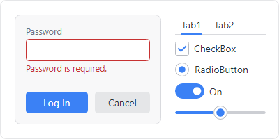
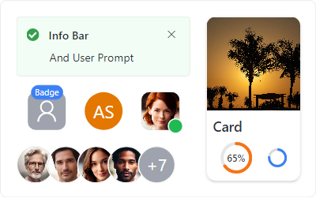

# Welcome

The Actipro @@PlatformName controls are a diverse set of UI controls, components, and themes for building beautiful @@PlatformName apps.

We believe that **@@PlatformName is a natural evolution of WPF** and provides an ideal platform for modern app development utilizing existing C# and WPF skills.  We are committed to enhancing and expanding our @@PlatformName product offerings going forward.

## Actipro @@PlatformName Free Products

Several products are **freely available** for anyone to use in their applications, providing a strong foundation for building high-quality applications.

### Themes

[Actipro Themes](themes/index.md) ensures that a great consistent visual appearance is applied to all controls within your application, regardless of whether they are Actipro Avalonia UI control products or native Avalonia UI controls.

### Shared Library

The [Actipro Shared Library](shared/index.md) is a common control library referenced by all our Actipro Avalonia UI controls.  It contains several very useful controls, components, value converters, and utilities that can be used in your projects.

### Core Library

The [Actipro Core Library](core/index.md) is a class library that is completely UI framework agnostic.  It contains numerous helpful utilities and base classes that can be used in your .NET projects.

## Actipro @@PlatformName Pro Products

Elevate your application by [licensing](licensing.md) additional professionally designed commercial controls and getting access to the XAML source for all of our default control styles and themes.

### Fundamentals

[Actipro Fundamentals](fundamentals/index.md) provides a collection of advanced controls that are useful for many different types of applications.

### XAML Source

Pro license customers can download the full XAML source for all our Free and Pro products.  The XAML source includes the default control styles and themes used by Actipro and native Avalonia controls in Actipro's themes.

Having the XAML source provides these benefits:
- **See Resource Usage** - See exactly which theme resources are used, and where throughout our products.
- **Learn Techniques** - Discover how styles and themes are built, and best practices applied.
- **Customize Control Themes** - Clone and adjust our default control themes as needed, either by replacing them or creating brand new control themes based on them.

## Getting Started

Use these steps as guidelines for how to get started with the Actipro @@PlatformName controls.

- **Download and Run Samples** - Follow the steps in the [Samples](samples.md) topic to download and run the open-source samples on your development machine.  Running the samples app is the best way to discover what the Actipro @@PlatformName controls have to offer.
- **Review Product Documentation** - Read through the product documentation linked above, along with the full [API Reference](api/index.md) to learn more about product features and capabilities.
- **Evaluate in Your Apps** - Reference the product [NuGet packages](nuget.md) to evaluate the products in your own apps, then configure [Themes](themes/index.md) based on your needs.
- **License Pro Controls** - You may use the free products in your own apps without any cost and can [license](licensing.md) the more advanced Actipro @@PlatformName Pro bundle if you wish to use it.
- **Deploy** - The [Deployment](deployment.md) topic lists the assemblies that you may redistribute with your apps based on your license.

## Additional Resources

- [Customizing String Resources](customizing-string-resources.md) - Localize or customize text found in UI.
- [Utilities](utilities/index.md) - Utilities that aid in working with the products.
- [Troubleshooting](troubleshooting.md) - Assistance for general troubleshooting items.
- [Supported Technologies](supported-technologies.md) - The frameworks, architectures, platforms, and IDEs that are supported.
- [GitHub Open-Source](open-source.md) - Details about the open-source repository.
- [Support](support.md) - How to obtain product support.
- [Third-Party Software](third-party.md) - List of third-party software used by the products.

## About Actipro Software

Actipro has been developing user interface controls and components since .NET was first released and offers many quality commercial products for UI frameworks like WPF, Windows Forms, and more.

What makes Actipro different from other companies?

- **Documentation and Samples** - A good product is only half the battle.  We've invested in creating an extensive amount of documentation and samples to get you up and running with our products in minutes.
- **Attention to Detail** - We pay attention to the minute details and add that extra polish to our products that really makes a difference to developers and end users alike.
- **Quality, Not Quantity** - Our products are well thought out and crafted with features and designs not found elsewhere.
- **Customer Satisfaction** - Every day we strive to please our customers through our commitment to excellence and responsiveness to inquiries.
- **Save Time and Money** - Why spend weeks developing in-house custom UI controls when ours are already mature and can be licensed for a tiny fraction of the cost required to create them on your own?
- **You Speak, We Listen** - We love to hear your feedback and often drive our products' designs based on the needs of our customers.
