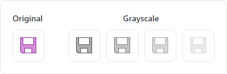
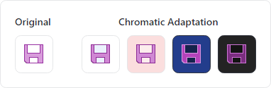

# DynamicImage

The [DynamicImage](xref:@ActiproUIRoot.Controls.DynamicImage) control is a drop-in replacement for `Image` that is the primary UI mechanism for interfacing with [ImageProvider](../../themes/image-provider.md) and its features, supporting:

- Chromatic adaptation (color shifting) for images, which allows images designed for light themes to be automatically adjusted for use in dark themes.
- Conversion of a monochrome vector image to render in the current foreground color.
- Automatic conversion of an image to grayscale with optional transparency when the control is disabled.
- Conversion of monochrome images to use the current foreground color.


*A single raster image that is altered to show normal, disabled, monochrome, and monochrome disabled states in both light and dark themes*

## Relationship with ImageProvider

The [DynamicImage](xref:@ActiproUIRoot.Controls.DynamicImage) control makes heavy use of [ImageProvider](../../themes/image-provider.md) and its functionality to adapt vector and raster images for use in various scenarios.  All image adaptations (grayscale, monochrome, and chromatic) are performed by an [ImageProvider](../../themes/image-provider.md).  Most scenarios will utilize a shared default instance of [ImageProvider](../../themes/image-provider.md), but individual `IImage` sources can also be configured to use a specific provider.

> [!IMPORTANT]
> Please see the [Image Provider](../../themes/image-provider.md) topic for more detail on how image providers work and how [DynamicImage](xref:@ActiproUIRoot.Controls.DynamicImage) ties into image provider features.

## Disabled State

Set the `IsEnabled` property to `false` and the image content will be rendered in grayscale.



*A single image that is altered to appear as grayscale with varying degrees of opacity*

To further emphasize the disabled state, use the [DisabledOpacity](xref:@ActiproUIRoot.Controls.DynamicImage.DisabledOpacity) property to blend the image content into the background.  The default value is `1.0`, meaning the opacity is not changed when disabled.

> [!NOTE]
> The [DisabledOpacity](xref:@ActiproUIRoot.Controls.DynamicImage.DisabledOpacity) is relative to the control's `Opacity`.  So if the [DisabledOpacity](xref:@ActiproUIRoot.Controls.DynamicImage.DisabledOpacity) is set to `0.5` and the control's `Opacity` is `0.8` then the effective opacity when disabled will be `0.4`.

## Monochrome Adaptation

Image content can be rendered in monochrome by setting the [UseMonochrome](xref:@ActiproUIRoot.Controls.DynamicImage.UseMonochrome) property to `true`.


*A single image that is altered to appear as monochrome based on a foreground color*

When `true`, the resulting monochrome image will be in the control's current [Foreground](xref:@ActiproUIRoot.Controls.DynamicImage.Foreground) color, which is an `IBrush` inherited from ancestor controls.

## Chromatic Adaptation

Chromatic adaptation allows images designed for light themes to be automatically adjusted (color shifted) for use with different background colors, especially dark backgrounds.



*A single image that is altered to adapt to the current background color*


> [!IMPORTANT]
> To support chromatic adaption, the associated [ImageProvider](../../themes/image-provider.md) must have its corresponding [ChromaticAdaptationMode](xref:@ActiproUIRoot.Media.ImageProvider.ChromaticAdaptationMode) property set to [Always](xref:@ActiproUIRoot.Media.ImageChromaticAdaptationMode.Always) or [DarkThemes](xref:@ActiproUIRoot.Media.ImageChromaticAdaptationMode.DarkThemes).

The current theme's default background color is used for chromatic adaptation. When using [ImageChromaticAdaptationMode](xref:@ActiproUIRoot.Media.ImageChromaticAdaptationMode).[Always](xref:@ActiproUIRoot.Media.ImageChromaticAdaptationMode.Always), the [DynamicImage](xref:@ActiproUIRoot.Controls.DynamicImage).[BackgroundHint](xref:@ActiproUIRoot.Controls.DynamicImage.BackgroundHint) property can be optionally set to an `IBrush` that defines a background color to use instead of the current theme's default background color.

## Examples

The following examples demonstrate how to define a [DynamicImage](xref:@ActiproUIRoot.Controls.DynamicImage) that will utilize the default [ImageProvider](../../themes/image-provider.md):

```xaml
xmlns:actipro="http://schemas.actiprosoftware.com/avaloniaui"
...

<!-- Standard image -->
<actipro:DynamicImage Width="32" Height="32" Source="/Images/Icons/Save32.png" />

<!-- Disabled image with 50% opacity -->
<actipro:DynamicImage Width="32" Height="32" Source="/Images/Icons/Save32.png" IsEnabled="False" DisabledOpacity="0.5" />

<!-- Monochrome image -->
<actipro:DynamicImage Width="32" Height="32" Source="/Images/Icons/Save32.png" UseMonochrome="True" />
```

Please see the [Image Provider](../../themes/image-provider.md) topic for more examples.