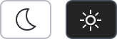

# Overview

The [ActiproSoftware.UI.Avalonia.Controls](xref:@ActiproUIRoot.Controls) namespace contains various user interface controls that may be used in your applications.

## AnimatedExpanderDecorator

The [AnimatedExpanderDecorator](animated-expander-decorator.md) is a `Decorator` that expands and contracts content using animation.

## ChromedTitleBar

The [ChromedTitleBar](chromed-title-bar.md) is a control that renders a customizable window title bar with optional content areas on the left, center, and right.

## CopyButton

The [CopyButton](copy-button.md) is a button that, when invoked, copies specified text to the clipboard.

## DynamicImage

The [DynamicImage](dynamic-image.md) control is a drop-in replacement for `Image` that is the primary UI mechanism for interfacing with [ImageProvider](xref:@ActiproUIRoot.Media.ImageProvider) and its features, supporting:

- Chromatic adaptation (color shifting) for images, which allows images designed for light themes to be automatically adjusted for use in dark themes.
- Conversion of a monochrome vector image to render in the current foreground color.
- Automatic conversion of an image to grayscale and optional transparency when the control is disabled.
- Conversion of monochrome images to use the current foreground color.

## HyperlinkTextBlock

The [HyperlinkTextBlock](hyperlink-textblock.md) is a `TextBlock` implementation that renders like a hyperlink and behaves like a `Button`.

## MeasureAdjuster

The [MeasureAdjuster](measure-adjuster.md) decorator can measure as zero size or round the measurement of its child content to integer values, even to the nearest even or odd numbers.  This ensures elements are measured and arranged as desired.

## MeshGradientPresenter

The [MeshGradientPresenter](mesh-gradient-presenter.md) control renders a gradient background that consists of multiple stacked radial gradients positioned at various locations.

## ScrollableOverflowPresenter

The [ScrollableOverflowPresenter](scrollable-overflow-presenter.md) control displays scroll buttons when its content overflows the available space.  Tap the buttons to scroll through the content or hold down a button to scroll quickly.

## ShadowChrome

[ShadowChrome](shadow-chrome.md) is a decorator that renders a drop shadow around its child control.

## ToggleThemeButton

The [ToggleThemeButton](toggle-theme-button.md) is a button that, when invoked, toggles a `RequestedThemeVariant` property value between `ThemeVariant.Light` and `ThemeVariant.Dark`.

## WindowResizeGrip

The [WindowResizeGrip](window-resize-grip.md) is a transparent gripper control that can be placed in the lower-right corner of a `Window` or its status bar, providing a larger area to drag-resize the `Window` both horizontally and vertically.