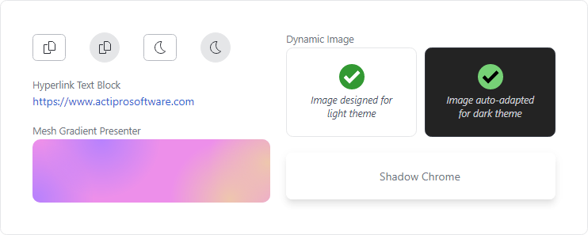

# Overview

The Actipro Shared Library is a common control library referenced by all of our @@PlatformName controls.  It contains a number of very useful controls and components that can be used in your projects.

*A collection of sample controls from the Shared Library*

> [!TIP]
> The Actipro Shared Library is a free product!  See our [Licensing](../licensing.md) topic for more details.

## Features

### General Controls

- An [AnimatedExpanderDecorator](controls/animated-expander-decorator.md) that expands and contracts content using animation.
- A [ChromedTitleBar](controls/chromed-title-bar.md) that renders a title bar with optional content areas on the left, center, and right.
- A [CopyButton](controls/copy-button.md) that, when invoked, copies specified text to the clipboard.
- A [DynamicImage](controls/dynamic-image.md) that is a drop-in replacement for `Image` and the primary UI mechanism for interfacing with [ImageProvider](../themes/image-provider.md) and its features, supporting grayscale, monochrome, and chromatic adaptation if image sources.
- A [HyperlinkTextBlock](controls/hyperlink-textblock.md) that is a `TextBlock` implementation which renders like a hyperlink and behaves like a `Button`.
- A [MeasureAdjuster](controls/measure-adjuster.md) decorator that can measure as zero size or round the measurement of its child content to integer values, thereby helping to ensure elements are arranged as desired and without sitting on a pixel boundary.
- A [MeshGradientPresenter](controls/mesh-gradient-presenter.md) that renders a mesh gradient background.
- A [ScrollableOverflowPresenter](controls/scrollable-overflow-presenter.md) control displays scroll buttons when its content overflows the available space.
- A [ShadowChrome](controls/shadow-chrome.md) decorator that renders a drop shadow around its child control.
- A [ToggleThemeButton](controls/toggle-theme-button.md) that, when invoked, toggles a `RequestedThemeVariant` property value between `ThemeVariant.Light` and `ThemeVariant.Dark`.
- A [WindowResizeGrip](controls/window-resize-grip.md) that can be placed in the lower-right corner of a `Window` or its status bar, providing a larger area to drag-resize the `Window` both horizontally and vertically.

### Shapes

- A [RingSlice](shapes/ring-slice.md) shape that renders a portion (or the entire circle) of a ring shape.

### Media

- The [UIColor](xref:@ActiproUIRoot.Media.UIColor) structure provides an enhanced representation of a color that supports the RGB, HSL, and HSV color models, conversion between models, and numerous other helper methods.  Static methods on the structure are used to create instances of the structure based on the supported models.

### Extension Methods

- Various [extension methods](extension-methods.md) are provided for several Avalonia types.

### Value Converters

- Multiple [value converters classes](value-converters.md) for doing everything from conditional (if...else) results to string formatting to mathematical expressions.
