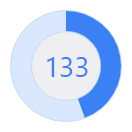
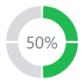

# Ring Slice

The [RingSlice](xref:@ActiproUIRoot.Controls.Shapes.RingSlice) shape renders a portion (or the entire circle) of a ring shape.  Its start and sweep angles, radius, thickness, and other stroke properties can be set.



*Several RingSlice shapes combined to create an appealing radial graph*

Ring slice shapes can be combined in many interesting ways within UI, primarily used to create progress indicators.

## Angles, Radius, and Thickness

The shape renders a ring slice between two angles, specified in degrees, where `0` is upward and the degree values increase as they go clockwise, meaning `90` degrees is to the right.

To render a quarter circle ring from the top to the right, use a [StartAngle](xref:@ActiproUIRoot.Controls.Shapes.RingSlice.StartAngle) of `0` and an [SweepAngle](xref:@ActiproUIRoot.Controls.Shapes.RingSlice.SweepAngle) of `90`.  The sweep angle is relative to the start angle, and can be negative.



*Several RingSlice controls used to render a four-step circular progress indicator*

The control also has two properties that control its radius and thickness.  The [Radius](xref:@ActiproUIRoot.Controls.Shapes.RingSlice.Radius) property specifies the outer radius of the ring.  The `StrokeThickness` property specifies the thickness of the ring, extending inward from the outer radius.

> [!TIP]
> Use a `StrokeThickness` value that is the same as the [Radius](xref:@ActiproUIRoot.Controls.Shapes.RingSlice.Radius) to render a pie slice.

## Other Stroke Properties

[RingSlice](xref:@ActiproUIRoot.Controls.Shapes.RingSlice) also supports all of the standard stroke properties found on a shape control.  This includes setting line caps to achieve flat, round or square line ends, or setting properties to render dashed lines.

```xaml
xmlns:actipro="http://schemas.actiprosoftware.com/avaloniaui"
...
<actipro:RingSlice Radius="60" EndAngle="270"
	Stroke="#9e5aac" StrokeThickness="6" StrokeLineCap="Round" StrokeDashArray="3" StrokeDashOffset="-1" />
```


## Entire Circle

When the [SweepAngle](xref:@ActiproUIRoot.Controls.Shapes.RingSlice.SweepAngle) is non-zero but normalizes to zero (e.g., a sweep angle of `360`), the ring slice will by default render a full circular ring.  The [IsRenderedWhenFullCircle](xref:@ActiproUIRoot.Controls.Shapes.RingSlice.IsRenderedWhenFullCircle) property can be set to `false` to disable this behavior.  When set to `false` and the sweep angle normalizes to zero, nothing will be rendered.

> [!NOTE]
> Degree angles are normalized when comparing equality.  Therefore, the angles `0` and `360` are considered to be the same angle.
