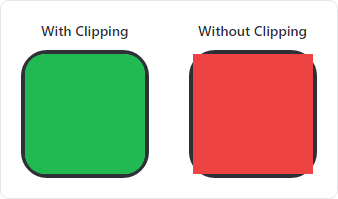

# Value Converters

The [ActiproSoftware.UI.Avalonia.Controls.Converters](xref:@ActiproUIRoot.Controls.Converters) namespace contains numerous value converters that can be used in XAML for working with data.

## BorderChildClipConverter

The [BorderChildClipConverter](xref:@ActiproUIRoot.Controls.Converters.BorderChildClipConverter) is a multi-value converter that can be applied to a `Border.Child` element's `Clip` property to ensure the child element is properly clipped based on the `Border.CornerRadius` value.

This converter is useful when the `Border.Child` element or another element within its hierarchy has a background that renders into the portion of the parent `Border` that is normally rounded off by the corner radius.



*A side-by-side example of a child with and without clipping to the containing border*


To use this converter, simply set the [BorderChildClipConverter](xref:@ActiproUIRoot.Controls.Converters.BorderChildClipConverter).`ClipToContainingBorder`attached property to `true` for any control within a `Border`. The attached property automatically configures the control's `Clip` property to bind to the appropriate values using the converter.

```xaml
xmlns:actipro="http://schemas.actiprosoftware.com/avaloniaui"
...
<Border BorderBrush="Black" BorderThickness="1" CornerRadius="8">
	<Grid actipro:BorderChildClipConverter.ClipToContainingBorder="True">
		<!-- Grid child controls here -->
	</Grid>
</Border>
```

## ComparisonConverter

The [ComparisonConverter](xref:@ActiproUIRoot.Controls.Converters.ComparisonConverter) represents a value converter that applies comparison logic on the value being converted and can return a different converted value based on the result of the comparison.

| Specification | Details |
|-----|-----|
| Original value | An `Object` that will be compared to another value (based on the `Operator`) to determine the converted result. |
| Converted result | An `Object` defined by [TrueResult](xref:@ActiproUIRoot.Controls.Converters.ComparisonConverter.TrueResult) if the comparison evaluates to `true`, or [FalseResult](xref:@ActiproUIRoot.Controls.Converters.ComparisonConverter.FalseResult) if the comparison evaluates to `false`. |
| Parameter | An `Object` that is compared with the original value. This value is ignored when the [Operator](xref:@ActiproUIRoot.Controls.Converters.ComparisonConverter.Operator) is `DefaultOrEmpty` or `NotDefaultOrEmpty`. |
| Target type | Not used. |
| Culture | Not used. |
| Can convert back | No. |

The following instance properties are available for the converter:

| Property | Description |
|-----|-----
| [FalseResult](xref:@ActiproUIRoot.Controls.Converters.ComparisonConverter.FalseResult) | The value of the converted result when the comparison evaluates to `false`. The default value is `false` (`Boolean`). |
| [Operator](xref:@ActiproUIRoot.Controls.Converters.ComparisonConverter.Operator) | The [ComparisonConverterOperator](xref:@ActiproUIRoot.Controls.Converters.ComparisonConverterOperator) used to compare values. The default value is [NotDefaultOrEmpty](xref:@ActiproUIRoot.Controls.Converters.ComparisonConverterOperator.NotDefaultOrEmpty). |
| [TrueResult](xref:@ActiproUIRoot.Controls.Converters.ComparisonConverter.TrueResult) | The value of the converted result when the comparison evaluates to `true`. The default value is boolean `true` (`Boolean`). |

The following example demonstrates how to use the converter with a non-default operator:

```xaml
xmlns:actipro="http://schemas.actiprosoftware.com/avaloniaui"
...
<UserControl.Resources>
	<actipro:ComparisonConverter x:Key="EqualToComparisonConverter" Operator="EqualTo" />
</UserControl.Resources>
...

<!--
Show the 'Clear' button of a TextBox when 'Allow Clear' is selected from a ComboBox
by using a binding which reads as "ComboBox.SelectedItem EqualTo 'Allow Clear'".
-->
<TextBox ...
	Classes.has-clear-button="{Binding #optionsComboBox.SelectedItem, Converter={StaticResource EqualToComparisonConverter}, ConverterParameter='Allow Clear'}"
	/>
```

## IconControlConverter

The [IconControlConverter](xref:@ActiproUIRoot.Controls.Converters.IconControlConverter) value converter can create a `Control` for a bound value that represents image data.  This is useful when data-binding a `MenuItem` control's `Icon` property to an image value like `IImage`, and the `MenuItem.Icon` must be a control.

The following example demonstrates how to use the converter when binding to a view model's `ImageSource` property (which is assumed to be a value of type `IImage`):

```xaml
xmlns:actipro="http://schemas.actiprosoftware.com/avaloniaui"
...
<UserControl.Resources>
	<actipro:IconControlConverter x:Key="IconControlConverter" />
</UserControl.Resources>
...

<MenuItem Icon="{Binding ImageSource, Converter={StaticResource IconControlConverter}}" ... />
```

By default, the `IconControlConverter` creates a `ContentControl` whose template is configured to use an [IconPresenter](xref:@ActiproUIRoot.Controls.Primitives.IconPresenter) for displaying the bound value.  The [IconPresenter](xref:@ActiproUIRoot.Controls.Primitives.IconPresenter).[DefaultContentTemplate](xref:@ActiproUIRoot.Controls.Primitives.IconPresenter.DefaultContentTemplate) determines which `IDataTemplate` will be used for the bound value.  See the [Icon Presenter](../themes/icon-presenter.md) topic for additional details.

## ImageKeyToImageSourceConverter

The [ImageKeyToImageSourceConverter](xref:@ActiproUIRoot.Controls.Converters.ImageKeyToImageSourceConverter) represents a value converter that uses an [ImageProvider](xref:@ActiproUIRoot.Media.ImageProvider) to lookup an `IImage` associated with a specified key.

| Specification | Details |
|-----|-----|
| Original value | A `String` key that identifies the image. Non-`String` values are automatically converted using `Object.ToString()`. The key value must be recognized by [ImageProvider](xref:@ActiproUIRoot.Media.ImageProvider).[GetImageSource](xref:@ActiproUIRoot.Media.ImageProvider.GetImageSource*).  Built-in keys are defined by [SharedImageSourceKeys](xref:@ActiproUIRoot.Media.SharedImageSourceKeys). |
| Converted result | An `IImage` or `null` if the key is not found. |
| Parameter | An [ImageProvider](xref:@ActiproUIRoot.Media.ImageProvider) instance or `null` to use [ImageProvider](xref:@ActiproUIRoot.Media.ImageProvider).[Default](xref:@ActiproUIRoot.Media.ImageProvider.Default). |
| Target type | Not used. |
| Culture | Not used. |
| Can convert back | No. |

The following example demonstrates how to use the converter with the key constants defined by the [SharedImageSourceKeys](xref:@ActiproUIRoot.Media.SharedImageSourceKeys) class:

```xaml
xmlns:actipro="http://schemas.actiprosoftware.com/avaloniaui"
...
<UserControl.Resources>
    <actipro:ImageKeyToImageSourceConverter x:Key="ImageKeyToImageSourceConverter" />
</UserControl.Resources>
...
<SampleControl Image="{Binding Source={x:Static actipro:SharedImageSourceKeys.Warning}, Converter={StaticResource ImageKeyToImageSourceConverter}}" ... />
```

## MathConverter

The [MathConverter](xref:@ActiproUIRoot.Controls.Converters.MathConverter) represents a single or multi-value converter that can perform basic mathematic calculations.

| Specification | Details |
|-----|-----|
| Original value 0 | A `Double` or `String` value to be parsed as a `Double`. This value corresponds to `x` or `p0` in the expression. |
| Original value 1 | (Optional) A `Double` or `String` value to be parsed as a `Double`. This value corresponds to `y` or `p1` in the expression. |
| Original value 2 | (Optional) A `Double` or `String` value to be parsed as a `Double`. This value corresponds to `z` or `p2` in the expression. |
| Original value 3 | (Optional) A `Double` or `String` value to be parsed as a `Double`. This value corresponds to `p3` in the expression. |
| Original value *N* | (Optional) A `Double` or `String` value to be parsed as a `Double`. This value corresponds to `pN` in the expression where *N* is the zero-based index of the value passed to the converter. |
| Converted result | The `String` returned by calling `ToLowerInvariant()` on the original value. |
| Parameter | A `String` that defines the mathematical expression, e.g., `"x + 2"`.  See *Mathematical Expressions* details below. |
| Target type | Used to define the converted result. `Double` parses the result as a `Double`. `Int64`, `Int32`, and `Int16` will round the `Double`-based result to the nearest whole number. `String` will convert the result using `Object.ToString()`. Other target types are not used and will return the result as a nullable `Object`. |
| Culture | Ignored. `InvariantCulture` is always used. |
| Can convert back | No. |

> [!IMPORTANT]
> All numeric values in an expression are parsed using `InvariantCulture` where comma (`,`) is the thousands separator, and decimal point (`.`) is the decimal separator.

### Mathematical Expressions

A mathematical expression uses variables to represent the values passed to the converter.  The variables `"x"`, `"y"`, and `"z"` represent the first, second, and third values, respectively. Alternatively, values can be referenced by their position where `"p0"`, `"p1"`, and `"p2"` also represent the first, second, and third values but can also use `"p3"`, `"p4"`, and so on for additional values beyond the first three.

The following binary operators are supported:

| Operator | Description |
|-----|-----|
| `+` | Addition |
| `-` | Subtraction |
| `*` | Multiplication |
| `/` | Division|

Standard order of operation and parenthetical grouping are supported reading from left-to-right.  Parentheses are evaluated first, then multiplication &amp; division, and finally addition &amp; subtraction.

The following functions are available to perform operations upon one or more values:

| Function | Description |
|-----|-----|
| `max(value1, value2)` | Returns the larger of two numbers. |
| `min(value1, value2)` | Returns the smaller of two numbers. |
| `round(value)` | Returns the value rounded to the nearest whole number. |

The following example demonstrates using a [MathConverter](xref:@ActiproUIRoot.Controls.Converters.MathConverter) to calculate the perimeter of a rectangle using the formula `perimeter = 2 * (width + height)`:

```xaml
xmlns:actipro="http://schemas.actiprosoftware.com/avaloniaui"
...
<UserControl.Resources>
	<actipro:MathConverter x:Key="MathConverter" />
</UserControl.Resources>
...
<TextBox IsReadOnly="True">
	<TextBox.Text>
		<MultiBinding
			Converter="{StaticResource MathConverter}"
			ConverterParameter="2 * (x + y)">

			<!-- X Value (Width) -->
			<Binding Path="WidthValue" />

			<!-- Y Value (Height) -->
			<Binding Path="HeightValue" />

		</MultiBinding>
	</TextBox.Text>
</TextBox>
```

## StringConverters

The static [StringConverters](xref:@ActiproUIRoot.Controls.Converters.StringConverters) class defines the following converters and, since they are static properties, can be consumed without first defining an instance as a resource:
- [ToLowerInvariant](xref:@ActiproUIRoot.Controls.Converters.StringConverters.ToLowerInvariant)
- [ToPercent](xref:@ActiproUIRoot.Controls.Converters.StringConverters.ToPercent)
- [ToUpperInvariant](xref:@ActiproUIRoot.Controls.Converters.StringConverters.ToLowerInvariant)

### ToLowerInvariant

The [StringConverters.ToLowerInvariant](xref:@ActiproUIRoot.Controls.Converters.StringConverters.ToLowerInvariant) property represents a value converter that can be used to change the character casing of a string to lowercase.

| Specification | Details |
|-----|-----|
| Original value | A `String` value. Non-`String` values are automatically converted using `Object.ToString()`. |
| Converted result | The `String` returned by calling `ToLowerInvariant()` on the original value. |
| Parameter | Not used. |
| Target type | Not used. |
| Culture | Not used. |
| Can convert back | No. |

```xaml
xmlns:actipro="http://schemas.actiprosoftware.com/avaloniaui"
...
<TextBox Text="{Binding Path=OriginalValue, Converter={x:Static actipro:StringConverters.ToLowerInvariant}, Mode=OneWay}" />
```

### ToPercent

The [StringConverters.ToPercent](xref:@ActiproUIRoot.Controls.Converters.StringConverters.ToPercent) property represents a value converter that converts between a number and a formatted percentage.  The percentage is simply the number multiplied by `100` with a percent indicator.

| Specification | Details |
|-----|-----|
| Original value | A `Double`, `Single`, or `Int32`. Other types will attempt to parse their `Object.ToString()` value as a `Double`. |
| Converted result | The original numeric value multiplied by `100` with a percent indicator.  For example, the value `0.25` will convert to `"25%"`. |
| Parameter | Not used. |
| Target type | Not used. |
| Culture | Ignored. `CurrentCulture` is always used. |
| Can convert back | No. |

```xaml
xmlns:actipro="http://schemas.actiprosoftware.com/avaloniaui"
...
<TextBox Text="{Binding Path=OriginalValue, Converter={x:Static actipro:StringConverters.ToPercent}, Mode=OneWay}" />
```

### ToUpperInvariant
The [StringConverters.ToUpperInvariant](xref:@ActiproUIRoot.Controls.Converters.StringConverters.ToUpperInvariant) property represents a value converter that can be
used to change the character casing of a string to uppercase.

| Specification | Details |
|-----|-----|
| Original value | A `String` value. Non-`String` values are automatically converted using `Object.ToString()`. |
| Converted result | The `String` returned by calling `ToUpperInvariant()` on the original value. |
| Parameter | Not used. |
| Target type | Not used. |
| Culture | Not used. |
| Can convert back | No. |

```xaml
xmlns:actipro="http://schemas.actiprosoftware.com/avaloniaui"
...
<TextBox Text="{Binding Path=OriginalValue, Converter={x:Static actipro:StringConverters.ToUpperInvariant}, Mode=OneWay}" />
```

## ThicknessConverter

The [ThicknessConverter](xref:@ActiproUIRoot.Controls.Converters.ThicknessConverter) represents a value converter that converts numeric or `Thickness` values into a new `Thickness`, optionally filtering which sides of the `Thickness` are converted.

| Specification | Details |
|-----|-----|
| Original value | A `Thickness` or `Double`. Other types will attempt to parse their `Object.ToString()` value as a `Double`. `Thickness` values will be applied to the corresponding sides of the converted result.  `Double` values will be applied uniformly to all sides of the converted result. |
| Converted result | A `Thickness`.  The [Filter](xref:@ActiproUIRoot.Controls.Converters.ThicknessConverter.Filter) property determines which sides are populated. The [BaseThickness](xref:@ActiproUIRoot.Controls.Converters.ThicknessConverter.BaseThickness) property determines the default value for sides excluded by the filter. |
| Parameter | Not used. |
| Target type | Not used. |
| Culture | Not used. |
| Can convert back | No. |

The following instance properties are available for the converter:

| Property | Description |
|-----|-----
| [BaseThickness](xref:@ActiproUIRoot.Controls.Converters.ThicknessConverter.BaseThickness) | A `Thickness` that defines the value to use for the converted result for any `Sides` excluded by the [Filter](xref:@ActiproUIRoot.Controls.Converters.ThicknessConverter.Filter).  |
| [Filter](xref:@ActiproUIRoot.Controls.Converters.ThicknessConverter.Filter) | The `Sides` to include in the converted result.  By default, all sides are populated from the original value. |

The following examples show how to use the converter:

```xaml
xmlns:actipro="http://schemas.actiprosoftware.com/avaloniaui"
...
<UserControl.Resources>
	<actipro:ThicknessConverter x:Key="AllSidesThicknessConverter" />
	<actipro:ThicknessConverter x:Key="LeftTopSidesThicknessConverter" Filter="Left, Top" BaseThickness="0,0,5,5" />
</UserControl.Resources>
...

<!-- Set all four sides -->
<SampleControl Margin="{Binding Path=OriginalValue, Converter={StaticResource AllSidesThicknessConverter}}" ... />

<!-- Only set the Left and Top sides, Right and Bottom will use BaseThickness -->
<SampleControl Margin="{Binding Path=OriginalValue, Converter={StaticResource LeftTopSidesThicknessConverter}}" ... />
```
