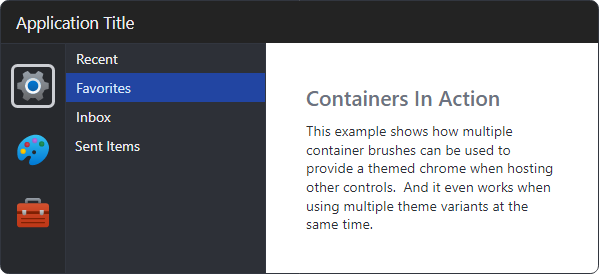

# Containers

Containers are areas of a user interface that contain other controls.  Actipro's themes include light and dark assets for five container levels based on the neutral color ramp.



*A combination of dark and light theme variants using containers*

## Backgrounds and Borders

Each container level has a corresponding background and border brush. Container level 1 has the lowest contrast background (i.e., lightest color in the light theme variant), and then contrast increases slightly with each level.


*Containers 1 through 5 showing background and border brushes using light theme variant on white background*


| Theme Resource | Description |
|-----|-----|
| [Container1BackgroundBrush](xref:@ActiproUIRoot.Themes.ThemeResourceKind.Container1BackgroundBrush) | Background brush for container 1 (lowest contrast). |
| [Container1BorderBrush](xref:@ActiproUIRoot.Themes.ThemeResourceKind.Container1BorderBrush) | Border brush for container 1. |
| [Container2BackgroundBrush](xref:@ActiproUIRoot.Themes.ThemeResourceKind.Container2BackgroundBrush) | Background brush for container 2. |
| [Container2BorderBrush](xref:@ActiproUIRoot.Themes.ThemeResourceKind.Container2BorderBrush) | Border brush for container 2. |
| [Container3BackgroundBrush](xref:@ActiproUIRoot.Themes.ThemeResourceKind.Container3BackgroundBrush) | Background brush for container 3. |
| [Container3BorderBrush](xref:@ActiproUIRoot.Themes.ThemeResourceKind.Container3BorderBrush) | Border brush for container 3. |
| [Container4BackgroundBrush](xref:@ActiproUIRoot.Themes.ThemeResourceKind.Container4BackgroundBrush) | Background brush for container 4. |
| [Container4BorderBrush](xref:@ActiproUIRoot.Themes.ThemeResourceKind.Container4BorderBrush) | Border brush for container 4. |
| [Container5BackgroundBrush](xref:@ActiproUIRoot.Themes.ThemeResourceKind.Container5BackgroundBrush) | Background brush for container 5. |
| [Container5BorderBrush](xref:@ActiproUIRoot.Themes.ThemeResourceKind.Container5BorderBrush) | Border brush for container 5. |

The following example demonstrates using a `Border` as a container:

```xaml
xmlns:actipro="http://schemas.actiprosoftware.com/avaloniaui"
...
<Border BorderThickness="1"
	Background="{actipro:ThemeResource Container1BackgroundBrush}"
	BorderBrush="{actipro:ThemeResource Container1BorderBrush}">

</Border>
```

## Foregrounds

Several default foreground brushes are available with varying degrees of contrast, and each brush is designed to render well on all container levels.


*Containers 1 through 5 showing default foreground brushes using light theme variant*

| Theme Resource | Description |
|-----|-----|
| [DefaultForegroundBrushMax](xref:@ActiproUIRoot.Themes.ThemeResourceKind.DefaultForegroundBrushMax) | Maximum contrast foreground brush. |
| [DefaultForegroundBrush](xref:@ActiproUIRoot.Themes.ThemeResourceKind.DefaultForegroundBrush) | Normal foreground brush. |
| [DefaultForegroundBrushSecondary](xref:@ActiproUIRoot.Themes.ThemeResourceKind.DefaultForegroundBrushSecondary) | Secondary foreground brush. |
| [DefaultForegroundBrushTertiary](xref:@ActiproUIRoot.Themes.ThemeResourceKind.DefaultForegroundBrushTertiary) | Tertiary foreground brush. |
| [DefaultForegroundBrushDisabled](xref:@ActiproUIRoot.Themes.ThemeResourceKind.DefaultForegroundBrushDisabled) | Disabled foreground brush. |

The following example demonstrates using the normal foreground brush:

```xaml
xmlns:actipro="http://schemas.actiprosoftware.com/avaloniaui"
...
<TextBlock Foreground="{actipro:ThemeResource DefaultForegroundBrush}" Text="Actipro Themes" />
```

See the [Typography](typography.md) topic for more details.