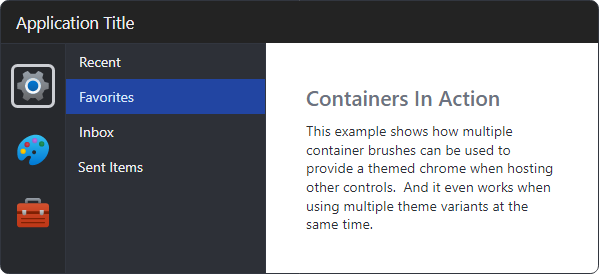

# Getting Started

Actipro's themes for Avalonia consist of control themes, theme resources (brushes, thicknesses, etc.), glyphs, and more.  Theme resources are dynamically generated by a theme generator that examines a theme definition's options.  The result is a beautiful and very flexible theme that is not limited to statically defined resources.

## Theme Variants

Avalonia's theme system uses theme variants to request theme assets for an application.  The theme variant is usually either `Light` or `Dark`.  Actipro's themes define assets for both the `Light` and `Dark` theme variants, allowing an application to instantly flip to another theme variant without having to reload the entire theme.

> [!TIP]
> See the external [How to Use Theme Variants](https://docs.avaloniaui.net/docs/next/guides/styles-and-resources/how-to-use-theme-variants) topic in the Avalonia documentation for additional details on the basics of theme variants.

### Application-Wide Theme Variant

Avalonia applications will either use a light or dark theme variant by default, depending on the operating system's settings.  If the operating system is configured to use a light appearance for applications, then an Avalonia application will default to a light theme variant, and vice versa.  The final resolved theme variant used in an application is designated by the `Application.ActualThemeVariant` property.

The application-wide theme variant can be manually specified by setting the `Application.RequestedThemeVariant` property.  This overrides the default behavior and forces a specific theme variant to be used.

#### Application.RequestedThemeVariant Example

The following example shows how to request that an application always load using a `Dark` theme variant.

```xaml
<Application ... RequestedThemeVariant="Dark">
	...
</Application>
```

### Hierarchy-Specific Theme Variant

It is possible to request a different theme variant for a specific subtree of visuals.  This can be useful for scenarios where you wish to have a mix of multiple theme variants in use at the same time.  For instance, you may wish for the left side navigation of a window to use a dark theme, but the rest of the application, such as the content area, should use a light theme.



*A combination of dark and light theme variants*

Avalonia's `ThemeVariantScope` control is used to tell a subtree of visuals to use an alternate theme variant from the one that would have normally been used, whether that higher level variant comes from another ancestor `ThemeVariantScope` or falls back to the `Application.ActualThemeVariant`.

#### ThemeVariantScope Example

The following example assumes the application has a `Dark` theme variant in place and shows how a `ThemeVariantScope` control can tell its subtree of visuals to use a `Light` theme variant instead.

```xaml
<StackPanel>
	<Button Content="Dark Button" />
	<ThemeVariantScope RequestedThemeVariant="Light">
		<Button Content="Light Button" />
	</ThemeVariantScope>
</StackPanel>
```

### Toggling Light/Dark Theme Variants

It's easy to toggle an application between light and dark theme variants.  If the entire application should be updated, set the `Application.RequestedThemeVariant` property to the new theme variant.  Or if only a subtree of visuals should be updated, set the containing `ThemeVariantScope.RequestedThemeVariant` property to the new theme variant instead.

> [!TIP]
> Place a [ToggleThemeButton](../shared/controls/toggle-theme-button.md) control in the user interface to give the end user the ability to toggle between light and dark themes.

## Using Actipro Themes

Actipro's themes can be integrated by adding a special [ModernTheme](xref:@ActiproUIRoot.Themes.ModernTheme) class, which inherits Avalonia's `Styles` class, to an application's `Application.Styles` collection.

The [ModernTheme](xref:@ActiproUIRoot.Themes.ModernTheme) class has several settings that tell it which theme assets to dynamically load into the `Application`, making them available for use.

### App.xaml

An instance of [ModernTheme](xref:@ActiproUIRoot.Themes.ModernTheme) can be placed directly in `Application.Styles` in XAML.

The following example shows how to load the free Actipro themes for most native Avalonia controls and free Actipro controls.

```xaml
<Application
	x:Class="MyCompany.App"
	xmlns="https://github.com/avaloniaui"
	xmlns:x="http://schemas.microsoft.com/winfx/2006/xaml"
	xmlns:actipro="http://schemas.actiprosoftware.com/avaloniaui"
	>
	<Application.Styles>

		<!-- NOTE: Any Styles included above the ModernTheme can be overwritten by the Actipro themes -->

		<actipro:ModernTheme />

		<!-- NOTE: Any Styles included below the ModernTheme cannot be overwritten by the Actipro themes -->

	</Application.Styles>
</Application>
```

> [!NOTE]
> See the "Includes Setting" section below for details on how to include themes for Actipro Avalonia UI Pro and optional native Avalonia controls.

> [!IMPORTANT]
> The order of entries in the `Application.Styles` is important.  For instance, if the Avalonia Fluent theme is also loaded in `Application.Styles` after the [ModernTheme](xref:@ActiproUIRoot.Themes.ModernTheme) entry, its control themes will take precedence over Actipro's theme.

### Includes Setting

The [ModernTheme.Includes](xref:@ActiproUIRoot.Themes.ModernTheme.Includes) property can be set to a [ThemeStyleIncludes](xref:@ActiproUIRoot.Themes.ThemeStyleIncludes) flags enumeration value to indicate the styles to include from various additional Actipro assemblies that are used within the application.

It is set to [None](xref:@ActiproUIRoot.Themes.ThemeStyleIncludes.None) by default, which means simply include core native Avalonia control themes, along with themes for Actipro's Shared Library controls, but nothing additional.

Since the property uses a flags enumeration, more than one value can be specified depending on your needs.

| Value | Description |
|-----|-----|
| [None](xref:@ActiproUIRoot.Themes.ThemeStyleIncludes.None) | No additional Actipro assembly styles beyond those for the `ActiproSoftware.Controls.Avalonia` NuGet package are included. |
| [NativeColorPicker](xref:@ActiproUIRoot.Themes.ThemeStyleIncludes.NativeColorPicker) | Styles for all assemblies in the `ActiproSoftware.Controls.Avalonia.Themes.ColorPicker` NuGet package. |
| [NativeDataGrid](xref:@ActiproUIRoot.Themes.ThemeStyleIncludes.NativeDataGrid) | Styles for all assemblies in the `ActiproSoftware.Controls.Avalonia.Themes.DataGrid` NuGet package. |
| [Pro](xref:@ActiproUIRoot.Themes.ThemeStyleIncludes.Pro) | Styles for all assemblies in the `ActiproSoftware.Controls.Avalonia.Pro` NuGet package. |
| [All](xref:@ActiproUIRoot.Themes.ThemeStyleIncludes.All) | Styles for all assemblies and NuGet packages listed above. |

> [!TIP]
> See the [Deployment](../deployment.md) topic for details on what is included in each NuGet package offering.  Be sure to reference the appropriate NuGet packages mentioned above before adding related [ThemeStyleIncludes](xref:@ActiproUIRoot.Themes.ThemeStyleIncludes) values.

#### Usage Examples

When only using Actipro's free Shared Library and native Avalonia controls:

```xaml
<Application ... xmlns:actipro="http://schemas.actiprosoftware.com/avaloniaui">
	<Application.Styles>

		<actipro:ModernTheme />

	</Application.Styles>
</Application>
```

When using Actipro's optional themes for the native ColorPicker and DataGrid controls, but no Actipro Pro controls:

```xaml
<Application ... xmlns:actipro="http://schemas.actiprosoftware.com/avaloniaui">
	<Application.Styles>

		<actipro:ModernTheme Includes="NativeColorPicker, NativeDataGrid" />

	</Application.Styles>
</Application>
```

When using Actipro's Pro controls, but not the native ColorPicker or DataGrid controls:

```xaml
<Application ... xmlns:actipro="http://schemas.actiprosoftware.com/avaloniaui">
	<Application.Styles>

		<actipro:ModernTheme Includes="Pro" />

	</Application.Styles>
</Application>
```

When using all controls:

```xaml
<Application ... xmlns:actipro="http://schemas.actiprosoftware.com/avaloniaui">
	<Application.Styles>

		<actipro:ModernTheme Includes="All" />

	</Application.Styles>
</Application>
```

### Native Control Themes Setting

Native Avalonia controls must have themes applied or else an application window will render without most or all content being visible.  Avalonia ships with the *Simple* and *Fluent* themes as built-in options.  Actipro's theme also defines control themes for all native Avalonia controls and can be used in place of the *Simple*, *Fluent*, or other themes.

The [ModernTheme.AreNativeControlThemesEnabled](xref:@ActiproUIRoot.Themes.ModernTheme.AreNativeControlThemesEnabled) property determines if native Avalonia controls are themed using Actipro's themes.

The default value of this property is `true`, meaning native Avalonia control theming is enabled by default when using Actipro themes.  Set the property to `false` to prevent this behavior.

> [!TIP]
> See the [Native Control Themes](native-control-themes.md) topic to learn more about Actipro's themes for native controls and the special styles and classes available.

#### No Native Control Themes Example

The following example shows how to use Avalonia's *Simple* theme for native Avalonia controls instead of Actipro's theming:

```xaml
<Application ... xmlns:actipro="http://schemas.actiprosoftware.com/avaloniaui">
	<Application.Styles>

		<SimpleTheme />
		<actipro:ModernTheme AreNativeControlThemesEnabled="False" />

	</Application.Styles>
</Application>
```

### Theme Definition Setting

The [ModernTheme.Definition](xref:@ActiproUIRoot.Themes.ModernTheme.Definition) property can be set to a [theme definition](theme-definitions.md) instance, which contains options for how theme resources will be generated.  This property only needs to be set if you wish to customize how the options are used by the [theme generator](theme-generator.md).

Setting the [ModernTheme.Definition](xref:@ActiproUIRoot.Themes.ModernTheme.Definition) property will trigger the theme generator to refresh all theme resources.  In the event you are not setting that property but are changing the options properties on the existing [ThemeDefinition](xref:@ActiproUIRoot.Themes.Generation.ThemeDefinition) instance, the [ModernTheme.RefreshResources](xref:@ActiproUIRoot.Themes.ModernTheme.RefreshResources*) method should be manually invoked afterward to force theme resource regeneration.

#### Accented Switches Example

The following example shows how to tell the theme to use accent colors for toggled switches by default, instead of using neutral colors.

```xaml
<Application ...
	xmlns:actipro="http://schemas.actiprosoftware.com/avaloniaui"
	xmlns:generation="using:ActiproSoftware.UI.Avalonia.Themes.Generation">
	<Application.Styles>

		<actipro:ModernTheme>
			<actipro:ModernTheme.Definition>
				<generation:ThemeDefinition UseAccentedSwitches="True" />
			</actipro:ModernTheme.Definition>
		</actipro:ModernTheme>

	</Application.Styles>
</Application>
```

#### Tab Appearance Example

The following example shows how to tell the theme to render tabs using a `Subtle` appearance instead of `Outline`.

```xaml
<Application ...
	xmlns:actipro="http://schemas.actiprosoftware.com/avaloniaui"
	xmlns:generation="using:ActiproSoftware.UI.Avalonia.Themes.Generation">
	<Application.Styles>

		<actipro:ModernTheme>
			<actipro:ModernTheme.Definition>
				<generation:ThemeDefinition TabAppearanceKind="Subtle" />
			</actipro:ModernTheme.Definition>
		</actipro:ModernTheme>

	</Application.Styles>
</Application>
```

> [!TIP]
> There are an enormous number of options in theme definitions that can alter the generated theme.  See the [theme definitions](theme-definitions.md) topic to learn more about the available options.