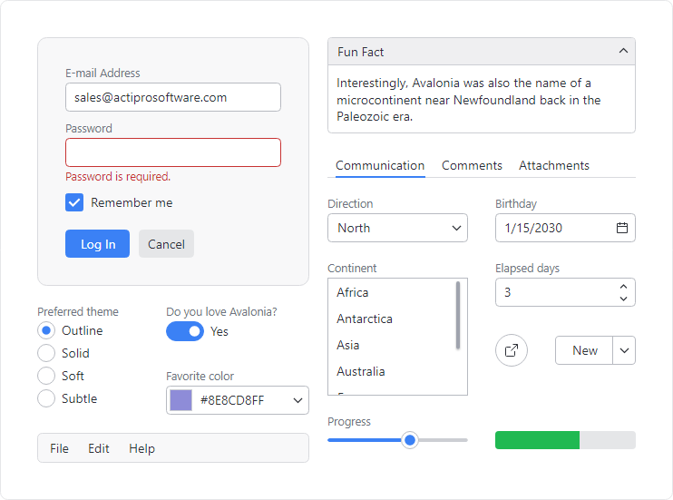

# Overview

Actipro Themes is a complete framework for managing the themes of Actipro and native @@PlatformName controls and may be used with your own custom controls as well.  High-level features include:

- Thoughtfully crafted, beautiful themes that bring a professional appearance to your entire @@PlatformName application.
- Control themes for all native @@PlatformName controls, enabled by default and designed to blend perfectly with Actipro controls.
- Themes contain resources for both `Light` and `Dark` theme variants, allowing for instant toggling between the two.
- Theme definitions with many options for determining how dynamically created theme resources are generated.
- Ability to swap to alternate theme definitions at run-time.
- Facilities for controlling user interface density (spacing) throughout an application.
- Theme assets, such as control themes, brushes, thicknesses, glyphs, and more that can be reused anywhere in an application.
- Extensibility points to customize and/or override theme assets, or even append custom assets.

*A collection of native controls with Actipro Themes active*

> [!TIP]
> Actipro Themes is a free product!  See our [Licensing](../licensing.md) topic for more details.

## Getting Started

Actipro's themes for Avalonia consist of control themes, theme resources (brushes, thicknesses, etc.), glyphs, and more.  Theme resources are dynamically generated by a theme generator that examines a theme definition's options.  The result is a beautiful and very flexible theme that is not limited to statically defined resources.

See the [Getting Started](getting-started.md) topic to discover the basics of themes and how easy it is to begin using Actipro Themes in your applications.

## Native Control Themes

Control themes are included for all native Avalonia controls that share the same design aesthetic as Actipro's own controls, allowing all controls to seamlessly mix within an application.  The native control themes are enabled by default, and many support a variety of design options, along with semantic color variants.

See the [Native Control Themes](native-control-themes.md) topic for the entire list of native control themes, in addition to information on their capabilities.

## Theme Definitions

A theme definition contains many options that guide a theme generator on how to dynamically generate theme resources.  Options cover a variety of theme aspects, including:

- Font families and base font size.
- Color ramps for accent and other semantic use scenarios (e.g., success, danger).
- Default appearance kind when there are several control theme variations (e.g., outline, solid) available for a control type, such as for buttons, switches, edit controls, etc.
- Corner radii, lengths, paddings, and margins.

See the [Theme Definitions](theme-definitions.md) topic to browse a list of available options and learn how to switch theme definitions at runtime.

## Theme Generator

A theme generator uses options in a theme definition to guide it on how to create theme resources like brushes, thicknesses, etc.  Distinct theme resources are generated for both `Light` and `Dark` theme variants, allowing for the theme generator to run a single time regardless of if an application toggles between light and dark modes at run-time.

See the [Theme Generator](theme-generator.md) topic to learn about the theme generation workflow and which extensibility points are available for customization purposes.

## Theme Assets

Assets are theme resources (brushes, thicknesses, etc.), control themes, and glyphs that are generated or provided as part of Actipro's themes.

While the Actipro control themes rely heavily on these theme assets, assets can also be reused in your own applications.  For instance, reusing theme resources like brushes in custom control themes and throughout the application chrome is necessary to maintain theme consistency across your application's user interface.  Several XAML markup extensions aid in reusing assets with minimal code.

See the [Theme Assets](theme-assets.md) topic for details on browsing theme resources, reusing various kinds of assets, and externally overriding assets.

## User Interface Density

User interface density describes how tightly controls are packed together.  A simple setting on a theme definition sets the application-wide user interface density, which can adjust appearance features such as margins, paddings, corner radii, lengths, and more.

See the [User Interface Density](user-interface-density.md) topic to discover how to set an application-wide user interface density and adjust elements based on the current density setting.

## Containers

Themes generate many brushes that are intended for use in building out the chrome of containers, which are elements such as `Border` that provide backgrounds for various views and host other controls inside.

See the [Containers](containers.md) topic to learn more about the container-related theme resource brushes and how to reuse them for application-wide theme consistency.

## Typography

Typography is extremely important in design and can dramatically affect the readability of application text.  Theme definitions offer options for the font families (default, heading, and code) and font sizes to use in the application.  And an exhaustive set of style classes are available for text-oriented controls that govern how text is styled, including optional use of semantic foreground colors.

See the [Typography](typography.md) topic to find how to configure font families, font sizes, and use various style classes to affect how text controls render.

## Scrolling

Several control themes enable modern appearances for scrollable controls that include the ability to toggle the visibility of line buttons and/or overlay scrollbars on top of the content.

See the [Scrolling](scrolling.md) topic to see which controls are supported and how to enable the desired functionality.

## Image Provider

An image provider has logic to manipulate images for various scenarios, such as:

- Chromatic adaptation (color shifting) for images, which allows images designed for light themes to be automatically adjusted for use in dark themes.
- Converting a monochrome vector image to render in the current foreground color.
- Conversion of images to grayscale.
- Conversion of images to monochrome, in a specified color.

See the [Image Provider](image-provider.md) topic to learn more about the capabilities of image provider and how it pairs with [DynamicImage](../shared/controls/dynamic-image.md) controls.

## Icon Presenter

The [IconPresenter](xref:@ActiproUIRoot.Controls.Primitives.IconPresenter) class is a `ContentPresenter` specifically for presenting icons based on any `object`-based value.

See the [Icon Presenter](icon-presenter.md) topic to learn more about configuring the control to support custom icons or incorporate the icon presenter into your own user interfaces.

