# Native Control Themes

Control themes are included for all native Avalonia controls that share the same design aesthetic as Actipro's own controls, allowing all controls to seamlessly mix within an application.  The native control themes are enabled by default, and many support a variety of design options, along with semantic color variants.

## Native Controls

Nearly all native Avalonia controls have control themes in the `ActiproSoftware.Controls.Avalonia` NuGet package.  The only exceptions are the native `ColorPicker` and `DataGrid` controls since they are shipped by the Avalonia team in separate optional NuGet packages of their own.

### Configuring

As described in the [Getting Started](getting-started.md) topic, when adding a [ModernTheme](xref:@ActiproUIRoot.Themes.ModernTheme) instance to the `Application.Styles` collection, native control themes will be enabled by default.  They can be disabled by setting the [AreNativeControlThemesEnabled](xref:@ActiproUIRoot.Themes.ModernTheme.AreNativeControlThemesEnabled) property to `false`.

This example of adding [ModernTheme](xref:@ActiproUIRoot.Themes.ModernTheme) to the `Application.Styles` collection automatically enables native control themes.

```xaml
<Application ... xmlns:actipro="http://schemas.actiprosoftware.com/avaloniaui">
	<Application.Styles>
		<actipro:ModernTheme />
	</Application.Styles>
</Application>
```

Several [theme definition](theme-definitions.md) options allow for selection of which control theme to use by default.  The following example shows how to tell the theme to render tabs using a `Subtle` appearance instead of `Outline`.

```xaml
<Application ... xmlns:actipro="http://schemas.actiprosoftware.com/avaloniaui">
	<Application.Styles>
		<actipro:ModernTheme>
			<actipro:ModernTheme.Definition>
				<actipro:ThemeDefinition TabAppearanceKind="Subtle" />
			</actipro:ModernTheme.Definition>
		</actipro:ModernTheme>
	</Application.Styles>
</Application>
```

### Color Variants


Most native controls support multiple semantic color variants.  Use one of the following style class names to alter the semantic color variant of supported controls:

- `accent` - Uses the theme's accent color ramp, which defaults to blue.
- `success` - Uses the theme's success color ramp, which defaults to green.
- `warning` - Uses the theme's warning color ramp, which defaults to orange.
- `danger` - Uses the theme's danger color ramp, which defaults to red.

### Control Theme Kinds

The [ControlThemeKind](xref:@ActiproUIRoot.Themes.ControlThemeKind) enumeration has a value for all controls supported by Actipro's themes, including many native control themes.

> [!TIP]
> See the [Theme Assets](theme-assets.md) topic for information on how to reference and use specific control themes, which is important when a control should have a non-default theme (e.g., a `Solid` button instead of an `Outline` button in a certain scenario), or when making a custom control theme that should be based on one of the Actipro control themes.

The lists below show the various control theme kind options for each type, and in parentheses indicate any style class names that can be specified to trigger the control theme.

This example shows how to render a solid accented button:

```xaml
<Button Classes="theme-solid accent" Content="Accented Solid Button" />
```

### Button Controls

All button control themes support the `accent`, `success`, `warning`, and `danger` style class names for semantic color variants.


*Button, DropDownButton, and SplitButton controls in the outline, solid, and soft themes showing sementic color variants*

#### Button Type

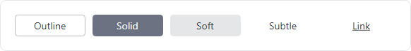

*Button controls in the outline, solid, soft, subtle, and link control themes with neutral colors*

- [ButtonBase](xref:@ActiproUIRoot.Themes.ControlThemeKind.ButtonBase) - Base control theme used by several others.
- [ButtonCard](xref:@ActiproUIRoot.Themes.ControlThemeKind.ButtonCard) (`theme-card`) - Has a card-like appearance.
- [ButtonInvisible](xref:@ActiproUIRoot.Themes.ControlThemeKind.ButtonInvisible) (`theme-invisible`) - Completely transparent but can be clicked.
- [ButtonLink](xref:@ActiproUIRoot.Themes.ControlThemeKind.ButtonLink) (`theme-link`) - Has a link-like appearance.
- [ButtonOutline](xref:@ActiproUIRoot.Themes.ControlThemeKind.ButtonOutline) (`theme-outline`) - Has an outline appearance.
- [ButtonSoft](xref:@ActiproUIRoot.Themes.ControlThemeKind.ButtonSoft) (`theme-soft`) - Has a soft fill appearance.
- [ButtonSolid](xref:@ActiproUIRoot.Themes.ControlThemeKind.ButtonSolid) (`theme-solid`) - Has a solid appearance.
- [ButtonSubtle](xref:@ActiproUIRoot.Themes.ControlThemeKind.ButtonSubtle) (`theme-subtle`) - Has a subtle fill appearance, only on pointer over.

#### DropDownButton Type


*DropDownButton controls in the outline, solid, soft, subtle, and link control themes with neutral colors*


- [DropDownButtonBase](xref:@ActiproUIRoot.Themes.ControlThemeKind.DropDownButtonBase) - Base control theme used by several others.
- [DropDownButtonLink](xref:@ActiproUIRoot.Themes.ControlThemeKind.DropDownButtonLink) (`theme-link`) - Has a link-like appearance.
- [DropDownButtonOutline](xref:@ActiproUIRoot.Themes.ControlThemeKind.DropDownButtonOutline) (`theme-outline`) - Has an outline appearance.
- [DropDownButtonSoft](xref:@ActiproUIRoot.Themes.ControlThemeKind.DropDownButtonSoft) (`theme-soft`) - Has a soft fill appearance.
- [DropDownButtonSolid](xref:@ActiproUIRoot.Themes.ControlThemeKind.DropDownButtonSolid) (`theme-solid`) - Has a solid appearance.
- [DropDownButtonSubtle](xref:@ActiproUIRoot.Themes.ControlThemeKind.DropDownButtonSubtle) (`theme-subtle`) - Has a subtle fill appearance, only on pointer over.

#### RepeatButton Type

`RepeatButton` uses the same control themes as `Button`.  See the "Button Type" section for details.

#### SplitButton Type


*SplitButton controls in the outline, solid, soft, subtle, and link control themes with neutral colors*


- [SplitButtonBase](xref:@ActiproUIRoot.Themes.ControlThemeKind.SplitButtonBase) - Base control theme used by several others.
- [SplitButtonLink](xref:@ActiproUIRoot.Themes.ControlThemeKind.SplitButtonLink) (`theme-link`) - Has a link-like appearance.
- [SplitButtonOutline](xref:@ActiproUIRoot.Themes.ControlThemeKind.SplitButtonOutline) (`theme-outline`) - Has an outline appearance.
- [SplitButtonSoft](xref:@ActiproUIRoot.Themes.ControlThemeKind.SplitButtonSoft) (`theme-soft`) - Has a soft fill appearance.
- [SplitButtonSolid](xref:@ActiproUIRoot.Themes.ControlThemeKind.SplitButtonSolid) (`theme-solid`) - Has a solid appearance.
- [SplitButtonSubtle](xref:@ActiproUIRoot.Themes.ControlThemeKind.SplitButtonSubtle) (`theme-subtle`) - Has a subtle fill appearance, only on pointer over.

#### ToggleButton Type

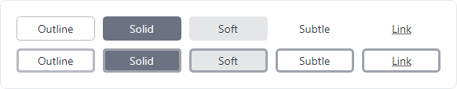

*ToggleButton controls in the outline, solid, soft, subtle, and link control themes with neutral colors with unchecked (top) and checked (bottom) states*


- [ToggleButtonLink](xref:@ActiproUIRoot.Themes.ControlThemeKind.ToggleButtonLink) (`theme-link`) - Has a link-like appearance.
- [ToggleButtonOutline](xref:@ActiproUIRoot.Themes.ControlThemeKind.ToggleButtonOutline) (`theme-outline`) - Has an outline appearance.
- [ToggleButtonSoft](xref:@ActiproUIRoot.Themes.ControlThemeKind.ToggleButtonSoft) (`theme-soft`) - Has a soft fill appearance.
- [ToggleButtonSolid](xref:@ActiproUIRoot.Themes.ControlThemeKind.ToggleButtonSolid) (`theme-solid`) - Has a solid appearance.
- [ToggleButtonSubtle](xref:@ActiproUIRoot.Themes.ControlThemeKind.ToggleButtonSubtle) (`theme-subtle`) - Has a subtle fill appearance, only on pointer over.

### Calendar Controls


*Calendar control in the default theme*

The following default control themes are defined for their respective control types:

- [Calendar](xref:@ActiproUIRoot.Themes.ControlThemeKind.Calendar)
- [CalendarButton](xref:@ActiproUIRoot.Themes.ControlThemeKind.CalendarButton)
- [CalendarDayButton](xref:@ActiproUIRoot.Themes.ControlThemeKind.CalendarDayButton)
- [CalendarItem](xref:@ActiproUIRoot.Themes.ControlThemeKind.CalendarItem)

### Edit Controls

All primary edit control themes support the `accent`, `success`, `warning`, and `danger` style class names for color variants.


*TextBox, ComboBox, ButtonSpinner, and CalendarDatePicker controls in the outline and soft themes showing sementic color variants*

#### AutoCompleteBox Type


*AutoCompleteBox controls in the outline and soft control themes with neutral colors*

- [AutoCompleteBoxBase](xref:@ActiproUIRoot.Themes.ControlThemeKind.AutoCompleteBoxBase) - Base control theme used by several others.
- [AutoCompleteBoxOutline](xref:@ActiproUIRoot.Themes.ControlThemeKind.AutoCompleteBoxOutline) (`theme-outline`) - Has an outline appearance.
- [AutoCompleteBoxSoft](xref:@ActiproUIRoot.Themes.ControlThemeKind.AutoCompleteBoxSoft) (`theme-soft`) - Has a soft fill appearance.

These style class names trigger special behaviors:
- `has-clear-button` or `clearButton` - Renders a **Clear** button in the control when it is non-empty and has focus.

#### ButtonSpinner Type

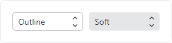

*ButtonSpinner controls in the outline and soft control themes with neutral colors*

- [ButtonSpinnerBase](xref:@ActiproUIRoot.Themes.ControlThemeKind.ButtonSpinnerBase) - Base control theme used by several others.
- [ButtonSpinnerOutline](xref:@ActiproUIRoot.Themes.ControlThemeKind.ButtonSpinnerOutline) (`theme-outline`) - Has an outline appearance.
- [ButtonSpinnerSoft](xref:@ActiproUIRoot.Themes.ControlThemeKind.ButtonSpinnerSoft) (`theme-soft`) - Has a soft fill appearance.

The following additional control theme is available for the `Button` used by the default control theme:

- [SpinnerButton](xref:@ActiproUIRoot.Themes.ControlThemeKind.SpinnerButton)

#### CalendarDatePicker Type

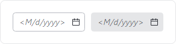

*CalendarDatePicker controls in the outline and soft control themes with neutral colors*

- [CalendarDatePickerBase](xref:@ActiproUIRoot.Themes.ControlThemeKind.CalendarDatePickerBase) - Base control theme used by several others.
- [CalendarDatePickerOutline](xref:@ActiproUIRoot.Themes.ControlThemeKind.CalendarDatePickerOutline) (`theme-outline`) - Has an outline appearance.
- [CalendarDatePickerSoft](xref:@ActiproUIRoot.Themes.ControlThemeKind.CalendarDatePickerSoft) (`theme-soft`) - Has a soft fill appearance.

The following additional control theme is available for the embedded `Button`:

- [TextBoxCalendarButton](xref:@ActiproUIRoot.Themes.ControlThemeKind.TextBoxCalendarButton) - Control theme for the embedded **Calendar** button that opens the picker.

#### ComboBox Type


*ComboBox controls in the outline and soft control themes with neutral colors*

- [ComboBoxBase](xref:@ActiproUIRoot.Themes.ControlThemeKind.ComboBoxBase) - Base control theme used by several others.
- [ComboBoxOutline](xref:@ActiproUIRoot.Themes.ControlThemeKind.ComboBoxOutline) (`theme-outline`) - Has an outline appearance.
- [ComboBoxSoft](xref:@ActiproUIRoot.Themes.ControlThemeKind.ComboBoxSoft) (`theme-soft`) - Has a soft fill appearance.

#### ComboBoxItem Type

- [ComboBoxItem](xref:@ActiproUIRoot.Themes.ControlThemeKind.ComboBoxItem) - Default control theme.

#### DatePicker Type

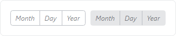

*DatePicker controls in the outline and soft control themes with neutral colors*

- [DatePickerBase](xref:@ActiproUIRoot.Themes.ControlThemeKind.DatePickerBase) - Base control theme used by several others.
- [DatePickerOutline](xref:@ActiproUIRoot.Themes.ControlThemeKind.DatePickerOutline) (`theme-outline`) - Has an outline appearance.
- [DatePickerSoft](xref:@ActiproUIRoot.Themes.ControlThemeKind.DatePickerSoft) (`theme-soft`) - Has a soft fill appearance.

#### DatePickerPresenter Type

- [DatePickerPresenter](xref:@ActiproUIRoot.Themes.ControlThemeKind.DatePickerPresenter) - Default control theme.

The following additional control theme is used by the default control theme:

- [DateTimePickerScrollButton](xref:@ActiproUIRoot.Themes.ControlThemeKind.DateTimePickerScrollButton) - `RepeatButton` controls used for scrolling date parts.

#### NumericUpDown Type


*NumericUpDown controls in the outline and soft control themes with neutral colors*

- [NumericUpDownBase](xref:@ActiproUIRoot.Themes.ControlThemeKind.NumericUpDownBase) - Base control theme used by several others.
- [NumericUpDownOutline](xref:@ActiproUIRoot.Themes.ControlThemeKind.NumericUpDownOutline) (`theme-outline`) - Has an outline appearance.
- [NumericUpDownSoft](xref:@ActiproUIRoot.Themes.ControlThemeKind.NumericUpDownSoft) (`theme-soft`) - Has a soft fill appearance.

#### TextBox Type


*TextBox controls in the outline and soft control themes with neutral colors*

- [TextBoxBase](xref:@ActiproUIRoot.Themes.ControlThemeKind.TextBoxBase) - Base control theme used by several others.
- [TextBoxOutline](xref:@ActiproUIRoot.Themes.ControlThemeKind.TextBoxOutline) (`theme-outline`) - Has an outline appearance.
- [TextBoxSoft](xref:@ActiproUIRoot.Themes.ControlThemeKind.TextBoxSoft) (`theme-soft`) - Has a soft fill appearance.
- [TextBoxEmbeddedOutline](xref:@ActiproUIRoot.Themes.ControlThemeKind.TextBoxEmbeddedOutline) - For a `TextBox` embedded in a control that has an outline appearance.
- [TextBoxEmbeddedSoft](xref:@ActiproUIRoot.Themes.ControlThemeKind.TextBoxEmbeddedSoft) - For a `TextBox` embedded in a control that has a soft fill appearance.

These style class names trigger special behaviors:
- `has-clear-button` or `clearButton` - Renders a **Clear** button in the control when it is non-empty and has focus.
- `has-reveal-password-button` or `revealPasswordButton` - Renders a **Reveal Password** button in the control when it is non-empty and is configured for passwords.

The following additional control themes are used by the `TextBox` control themes:

- [TextBoxButtonBase](xref:@ActiproUIRoot.Themes.ControlThemeKind.TextBoxButtonBase) - Base control theme for `Button` controls embedded in a `TextBox`.
- [TextBoxCalendarButton](xref:@ActiproUIRoot.Themes.ControlThemeKind.TextBoxCalendarButton) - Control theme for the **Calendar** button.
- [TextBoxClearButton](xref:@ActiproUIRoot.Themes.ControlThemeKind.TextBoxClearButton) - Control theme for the **Clear** button.
- [TextBoxRevealPasswordToggleButton](xref:@ActiproUIRoot.Themes.ControlThemeKind.TextBoxRevealPasswordToggleButton) - Control theme for the **Reveal Password** button.

#### TimePicker Type

- [TimePickerBase](xref:@ActiproUIRoot.Themes.ControlThemeKind.TimePickerBase) - Base control theme used by several others.
- [TimePickerOutline](xref:@ActiproUIRoot.Themes.ControlThemeKind.TimePickerOutline) (`theme-outline`) - Has an outline appearance.
- [TimePickerSoft](xref:@ActiproUIRoot.Themes.ControlThemeKind.TimePickerSoft) (`theme-soft`) - Has a soft fill appearance.

#### TimePickerPresenter Type

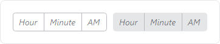

*TimePicker controls in the outline and soft control themes with neutral colors*

- [TimePickerPresenter](xref:@ActiproUIRoot.Themes.ControlThemeKind.TimePickerPresenter) - Default control theme.

The following additional control theme is used by the default control theme:

- [DateTimePickerScrollButton](xref:@ActiproUIRoot.Themes.ControlThemeKind.DateTimePickerScrollButton) - `RepeatButton` controls used for scrolling time parts.

### List Controls

#### ItemsControl Type

- [ItemsControl](xref:@ActiproUIRoot.Themes.ControlThemeKind.ItemsControl) - Default control theme.
- [ItemsControlScrollableInline](xref:@ActiproUIRoot.Themes.ControlThemeKind.ItemsControlScrollableInline) (`theme-scroll-inline`) - Uses an inline `ScrollViewer`.
- [ItemsControlScrollableOverlay](xref:@ActiproUIRoot.Themes.ControlThemeKind.ItemsControlScrollableOverlay) (`theme-scroll-overlay`) - Uses an overlay `ScrollViewer`.

#### ListBox Type

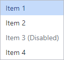

*ListBox control in the default theme*

- [ListBox](xref:@ActiproUIRoot.Themes.ControlThemeKind.ListBox) - Default control theme.

#### ListBoxItem Type

- [ListBoxItem](xref:@ActiproUIRoot.Themes.ControlThemeKind.ListBoxItem) - Default control theme.

#### TreeView Type


*TreeView control in the default theme*

- [TreeView](xref:@ActiproUIRoot.Themes.ControlThemeKind.TreeView) - Default control theme.

#### TreeViewItem Type

- [TreeViewItem](xref:@ActiproUIRoot.Themes.ControlThemeKind.TreeViewItem) - Default control theme.

The following additional control theme is used by the default control theme:

- [TreeViewItemToggleButton](xref:@ActiproUIRoot.Themes.ControlThemeKind.TreeViewItemToggleButton) - Control theme for the `ToggleButton` that expands/collapses a `TreeViewItem`.

### Menu Controls

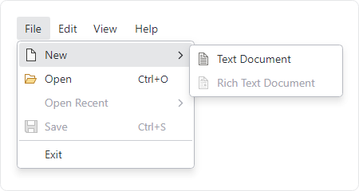

*Menu control in the default theme with sub menus open*

#### ContextMenu Type

- [ContextMenu](xref:@ActiproUIRoot.Themes.ControlThemeKind.ContextMenu) - Default control theme.

#### Menu Type

- [Menu](xref:@ActiproUIRoot.Themes.ControlThemeKind.Menu) - Default control theme.

#### MenuFlyoutPresenter Type

- [MenuFlyoutPresenter](xref:@ActiproUIRoot.Themes.ControlThemeKind.MenuFlyoutPresenter) - Default control theme.

#### MenuItem Type

- [MenuItem](xref:@ActiproUIRoot.Themes.ControlThemeKind.MenuItem) - Default control theme.
- [MenuItemHeading](xref:@ActiproUIRoot.Themes.ControlThemeKind.MenuItemHeading) (`theme-menuitem-heading`) - Bold heading that is a disabled menu item.
- [MenuItemTopLevel](xref:@ActiproUIRoot.Themes.ControlThemeKind.MenuItemTopLevel) - A menu item directly within a menu bar.

#### NativeMenuBar Type

- [NativeMenuBar](xref:@ActiproUIRoot.Themes.ControlThemeKind.NativeMenuBar) - Default control theme.

#### Separator Type

- [Separator](xref:@ActiproUIRoot.Themes.ControlThemeKind.Separator) - Default control theme.

#### Other Menu Control Themes

The following additional control themes are used by the menu control themes:

- [MenuScrollViewer](xref:@ActiproUIRoot.Themes.ControlThemeKind.MenuScrollViewer) - Used by `ScrollViewer` of scrollable menus.
- [MenuScrollViewerLineButton](xref:@ActiproUIRoot.Themes.ControlThemeKind.MenuScrollViewerLineButton) - Used by `RepeatButton` to scroll up/down in `MenuScrollViewer` control theme.

### Scroll Controls

Scrollbars can optionally toggle the visibility of line buttons.  See the [Scrolling](scrolling.md) topic for more details.

#### ScrollBar Type


*ScrollBar controls in the default and line buttons control themes*

- [ScrollBar](xref:@ActiproUIRoot.Themes.ControlThemeKind.ScrollBar) - Default control theme.

The following additional control themes are used by the default control theme:

- [ScrollBarLineButton](xref:@ActiproUIRoot.Themes.ControlThemeKind.ScrollBarLineButton) - The control theme for the `RepeatButton` instances on the scrollbar that increase/decrease the scroll position by small values.
- [ScrollBarPageButton](xref:@ActiproUIRoot.Themes.ControlThemeKind.ScrollBarPageButton) - The control theme for the invisible `RepeatButton` instances on the scrollbar track that increase/decrease the scroll position by large values.
- [ScrollBarThumb](xref:@ActiproUIRoot.Themes.ControlThemeKind.ScrollBarThumb) - The control theme for the `Thumb` control when *not* using line buttons.
- [ScrollBarThumbBetweenButtons](xref:@ActiproUIRoot.Themes.ControlThemeKind.ScrollBarThumbBetweenButtons) - The control theme for the `Thumb` control when using line buttons.

#### ScrollViewer Type


*ScrollViewer controls in the default and overlay control themes*

- [ScrollViewerBase](xref:@ActiproUIRoot.Themes.ControlThemeKind.ScrollViewerBase) - Base control theme used by several others.
- [ScrollViewer](xref:@ActiproUIRoot.Themes.ControlThemeKind.ScrollViewer) - The scrollbars do not overlay the content.
- [ScrollViewerOverlay](xref:@ActiproUIRoot.Themes.ControlThemeKind.ScrollViewerOverlay) (`theme-scroll-overlay`) - The scrollbars overlay the content.

### Switch Controls

All switch control themes support the `accent`, `success`, `warning`, and `danger` style class names for semantic color variants.

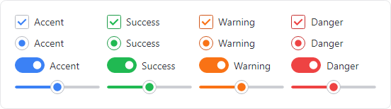

*CheckBox, RadioButton, ToggleSwitch, and Slider controls in the outline and solid themes showing sementic color variants*

The `CheckBox`, `RadioButton`, and `ToggleSwitch` control type themes automatically adjust their size to match the control's font size.  For example, a `CheckBox` at a 24pt font size will render a larger check UI element than one with a 12pt font size.  The relative size of those controls can be explicitly set using one of following style class names:

- `size-xs` - Sizes the control consistent with an extra-small font size.
- `size-sm` - Sizes the control consistent with a small font size.
- `size-md` - Sizes the control consistent with a normal font size.
- `size-lg` - Sizes the control consistent with a large font size.
- `size-xl` - Sizes the control consistent with an extra-large font size.

#### CheckBox Type


*CheckBox controls in the outline and solid control themes with neutral colors in checked and unchecked states*

- [CheckBoxBase](xref:@ActiproUIRoot.Themes.ControlThemeKind.CheckBoxBase) - Base control theme used by several others.
- [CheckBoxOutline](xref:@ActiproUIRoot.Themes.ControlThemeKind.CheckBoxOutline) (`theme-outline`) - Has an outline appearance.
- [CheckBoxSolid](xref:@ActiproUIRoot.Themes.ControlThemeKind.CheckBoxSolid) (`theme-solid`) - Has a solid appearance.
- [CheckBoxMenuIndicator](xref:@ActiproUIRoot.Themes.ControlThemeKind.CheckBoxMenuIndicator) - Used within `MenuItem.Icon` to indicate checked state.

#### RadioButton Type

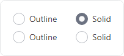

*RadioButton controls in the outline and solid control themes with neutral colors in checked and unchecked states*

- [RadioButtonBase](xref:@ActiproUIRoot.Themes.ControlThemeKind.RadioButtonBase) - Base control theme used by several others.
- [RadioButtonOutline](xref:@ActiproUIRoot.Themes.ControlThemeKind.RadioButtonOutline) (`theme-outline`) - Has an outline appearance.
- [RadioButtonSolid](xref:@ActiproUIRoot.Themes.ControlThemeKind.RadioButtonSolid) (`theme-solid`) - Has a solid appearance.
- [RadioButtonMenuIndicator](xref:@ActiproUIRoot.Themes.ControlThemeKind.RadioButtonMenuIndicator) - Used within `MenuItem.Icon` to indicate checked state.

#### Slider Type

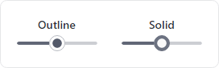

*Slider controls in the outline and solid control themes with neutral colors*

- [SliderBase](xref:@ActiproUIRoot.Themes.ControlThemeKind.SliderBase) - Base control theme used by several others.
- [SliderOutline](xref:@ActiproUIRoot.Themes.ControlThemeKind.SliderOutline) (`theme-outline`) - Has an outline appearance.
- [SliderSolid](xref:@ActiproUIRoot.Themes.ControlThemeKind.SliderSolid) (`theme-solid`) - Has a solid appearance.

The following additional control themes are used by the `Slider` control themes:

- [SliderThumb](xref:@ActiproUIRoot.Themes.ControlThemeKind.SliderThumb) - The control theme for the `Thumb` control.
- [SliderTrackButton](xref:@ActiproUIRoot.Themes.ControlThemeKind.SliderTrackButton) - The control theme for the `RepeatButton` instances on the track that change the value.

#### ToggleSwitch Type

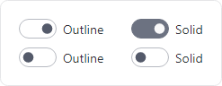

*ToggleSwitch controls in the outline and solid control themes with neutral colors in on and off states*

- [ToggleSwitchBase](xref:@ActiproUIRoot.Themes.ControlThemeKind.ToggleSwitchBase) - Base control theme used by several others.
- [ToggleSwitchOutline](xref:@ActiproUIRoot.Themes.ControlThemeKind.ToggleSwitchOutline) (`theme-outline`) - Has an outline appearance.
- [ToggleSwitchSolid](xref:@ActiproUIRoot.Themes.ControlThemeKind.ToggleSwitchSolid) (`theme-solid`) - Has a solid appearance.

### Tab Controls


*TabControl controls in the outline and subtle control themes (TabStrip has the same appearance)*

Tab controls do not support semantic color variants.

#### TabControl Type

- [TabControlBase](xref:@ActiproUIRoot.Themes.ControlThemeKind.TabControlBase) - Base control theme used by several others.
- [TabControlOutline](xref:@ActiproUIRoot.Themes.ControlThemeKind.TabControlOutline) (`theme-outline`) - Has an outline appearance.
- [TabControlSubtle](xref:@ActiproUIRoot.Themes.ControlThemeKind.TabControlSubtle) (`theme-subtle`) - Has a subtle appearance with accent underline for selection.

#### TabItem Type

- [TabItemOutline](xref:@ActiproUIRoot.Themes.ControlThemeKind.TabItemOutline) (`theme-outline`) - Has an outline appearance.
- [TabItemSubtle](xref:@ActiproUIRoot.Themes.ControlThemeKind.TabItemSubtle) (`theme-subtle`) - Has a subtle appearance with accent underline for selection.

#### TabStrip Type

- [TabStripBase](xref:@ActiproUIRoot.Themes.ControlThemeKind.TabStripBase) - Base control theme used by several others.
- [TabStripOutline](xref:@ActiproUIRoot.Themes.ControlThemeKind.TabStripOutline) (`theme-outline`) - Has an outline appearance.
- [TabStripSubtle](xref:@ActiproUIRoot.Themes.ControlThemeKind.TabStripSubtle) (`theme-subtle`) - Has a subtle appearance with accent underline for selection.

#### TabStripItem Type

- [TabStripItemOutline](xref:@ActiproUIRoot.Themes.ControlThemeKind.TabStripItemOutline) (`theme-outline`) - Has an outline appearance.
- [TabStripItemSubtle](xref:@ActiproUIRoot.Themes.ControlThemeKind.TabStripItemSubtle) (`theme-subtle`) - Has a subtle appearance with accent underline for selection.

### Typography Controls

All typography control themes support the `accent`, `success`, `warning`, and `danger` style class names for semantic color variants.


*TextBlock controls in the default, heading, body, and code themes showing sementic color variants*

Each typography control type defines "body", "code", and "heading" control themes. The relative font size of these control themes can be explicitly set using one of following style class names:

- `size-xs` - An extra-small font size.
- `size-sm` - A small font size.
- `size-md` - A normal font size.
- `size-lg` - A large font size.
- `size-xl` - An extra-large font size.

#### Label Type

- [LabelBase](xref:@ActiproUIRoot.Themes.ControlThemeKind.LabelBase) - Base control theme used by several others.
- [Label](xref:@ActiproUIRoot.Themes.ControlThemeKind.Label) - Default control theme.
- [LabelBody](xref:@ActiproUIRoot.Themes.ControlThemeKind.LabelBody) (`theme-text-body`) - Uses a font family and size for body text.
- [LabelCode](xref:@ActiproUIRoot.Themes.ControlThemeKind.LabelCode) (`theme-text-code`) - Uses a font family and size for code text.
- [LabelHeading](xref:@ActiproUIRoot.Themes.ControlThemeKind.LabelHeading) (`theme-text-heading`) - Uses a font family and size for heading text.
- [LabelFormControlLabel](xref:@ActiproUIRoot.Themes.ControlThemeKind.LabelFormControlLabel) (`theme-form-control-label`) - Formatted as the label for a form control.
- [LabelFormControlMessage](xref:@ActiproUIRoot.Themes.ControlThemeKind.LabelFormControlMessage) (`theme-form-control-message`) - Formatted as the message for a form control (typically shown below the control).

#### SelectableTextBlock Type

- [SelectableTextBlockBase](xref:@ActiproUIRoot.Themes.ControlThemeKind.SelectableTextBlockBase) - Base control theme used by several others.
- [SelectableTextBlock](xref:@ActiproUIRoot.Themes.ControlThemeKind.SelectableTextBlock) - Default control theme.
- [SelectableTextBlockBody](xref:@ActiproUIRoot.Themes.ControlThemeKind.SelectableTextBlockBody) (`theme-text-body`) - Uses a font family and size for body text.
- [SelectableTextBlockCode](xref:@ActiproUIRoot.Themes.ControlThemeKind.SelectableTextBlockCode) (`theme-text-code`) - Uses a font family and size for code text.
- [SelectableTextBlockHeading](xref:@ActiproUIRoot.Themes.ControlThemeKind.SelectableTextBlockHeading) (`theme-text-heading`) - Uses a font family and size for heading text.
- [SelectableTextBlockFormControlLabel](xref:@ActiproUIRoot.Themes.ControlThemeKind.SelectableTextBlockFormControlLabel) (`theme-form-control-label`) - Formatted as the label for a form control.
- [SelectableTextBlockFormControlMessage](xref:@ActiproUIRoot.Themes.ControlThemeKind.SelectableTextBlockFormControlMessage) (`theme-form-control-message`) - Formatted as the message for a form control (typically shown below the control).

#### TextBlock Type

- [TextBlock](xref:@ActiproUIRoot.Themes.ControlThemeKind.TextBlock) - Default control theme.
- [TextBlockBody](xref:@ActiproUIRoot.Themes.ControlThemeKind.TextBlockBody) (`theme-text-body`) - Uses a font family and size for body text.
- [TextBlockCode](xref:@ActiproUIRoot.Themes.ControlThemeKind.TextBlockCode) (`theme-text-code`) - Uses a font family and size for code text.
- [TextBlockHeading](xref:@ActiproUIRoot.Themes.ControlThemeKind.TextBlockHeading) (`theme-text-heading`) - Uses a font family and size for heading text.
- [TextBlockFormControlLabel](xref:@ActiproUIRoot.Themes.ControlThemeKind.TextBlockFormControlLabel) (`theme-form-control-label`) - Formatted as the label for a form control.
- [TextBlockFormControlMessage](xref:@ActiproUIRoot.Themes.ControlThemeKind.TextBlockFormControlMessage) (`theme-form-control-message`) - Formatted as the message for a form control (typically shown below the control).

### Other Controls

#### CaptionButtons Type


*CaptionButtons control in the default theme*

- [CaptionButtons](xref:@ActiproUIRoot.Themes.ControlThemeKind.CaptionButtons) - Default control theme.

The following additional control themes are used by the default control themes:

- [TitleBarButton](xref:@ActiproUIRoot.Themes.ControlThemeKind.TitleBarButton) - Individual `Button` controls.

#### DataValidationErrors Type

- [DataValidationErrors](xref:@ActiproUIRoot.Themes.ControlThemeKind.DataValidationErrors) - Default control theme that shows errors below a control.
- [ToolTipDataValidationErrors](xref:@ActiproUIRoot.Themes.ControlThemeKind.ToolTipDataValidationErrors) - Default control theme that shows errors in a tooltip.

#### Expander Type


*Expander control in the default theme expanded down*

- [Expander](xref:@ActiproUIRoot.Themes.ControlThemeKind.Expander) - Default control theme.

The following additional control themes are available for the `ToggleButton` used by the default control theme:

- [ExpanderToggleButtonBase](xref:@ActiproUIRoot.Themes.ControlThemeKind.ExpanderToggleButtonBase) - Base control theme used by several others.
- [ExpanderToggleButtonDown](xref:@ActiproUIRoot.Themes.ControlThemeKind.ExpanderToggleButtonDown) - Toggle button that opens down.
- [ExpanderToggleButtonLeft](xref:@ActiproUIRoot.Themes.ControlThemeKind.ExpanderToggleButtonLeft) - Toggle button that opens to the left.
- [ExpanderToggleButtonRight](xref:@ActiproUIRoot.Themes.ControlThemeKind.ExpanderToggleButtonRight) - Toggle button that opens to the right.
- [ExpanderToggleButtonUp](xref:@ActiproUIRoot.Themes.ControlThemeKind.ExpanderToggleButtonUp) - Toggle button that opens up.

#### NotificationCard Type

- [NotificationCard](xref:@ActiproUIRoot.Themes.ControlThemeKind.NotificationCard) - Default control theme with color variants based on the notification type.

#### ProgressBar Type

The default control theme supports the `accent`, `success`, `warning`, and `danger` style class names for semantic color variants.

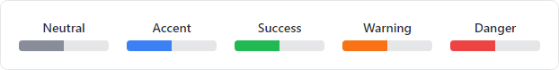

*ProgressBar controls in the default theme with neutral and sementic color variants*

- [ProgressBar](xref:@ActiproUIRoot.Themes.ControlThemeKind.ProgressBar) - Default control theme.

#### Additional Types with Default Themes

The following default control themes are defined for their respective control types:

- [AdornerLayer](xref:@ActiproUIRoot.Themes.ControlThemeKind.AdornerLayer)
- [Carousel](xref:@ActiproUIRoot.Themes.ControlThemeKind.Carousel)
- [ContentControl](xref:@ActiproUIRoot.Themes.ControlThemeKind.ContentControl)
- [EmbeddableControlRoot](xref:@ActiproUIRoot.Themes.ControlThemeKind.EmbeddableControlRoot)
- [EmbeddableCoFlyoutPresenterntrolRoot](xref:@ActiproUIRoot.Themes.ControlThemeKind.FlyoutPresenter)
- [GridSplitter](xref:@ActiproUIRoot.Themes.ControlThemeKind.GridSplitter)
- [ManagedFileChooser](xref:@ActiproUIRoot.Themes.ControlThemeKind.ManagedFileChooser)
- [OverlayPopupHost](xref:@ActiproUIRoot.Themes.ControlThemeKind.OverlayPopupHost)
- [PathIcon](xref:@ActiproUIRoot.Themes.ControlThemeKind.PathIcon)
- [PopupRoot](xref:@ActiproUIRoot.Themes.ControlThemeKind.PopupRoot)
- [RefreshContainer](xref:@ActiproUIRoot.Themes.ControlThemeKind.RefreshContainer)
- [RefreshVisualizer](xref:@ActiproUIRoot.Themes.ControlThemeKind.RefreshVisualizer)
- [SplitView](xref:@ActiproUIRoot.Themes.ControlThemeKind.SplitView)
- [ThemeVariantScope](xref:@ActiproUIRoot.Themes.ControlThemeKind.ThemeVariantScope)
- [TitleBar](xref:@ActiproUIRoot.Themes.ControlThemeKind.TitleBar)
- [ToolTip](xref:@ActiproUIRoot.Themes.ControlThemeKind.ToolTip)
- [TransitioningContentControl](xref:@ActiproUIRoot.Themes.ControlThemeKind.TransitioningContentControl)
- [UserControl](xref:@ActiproUIRoot.Themes.ControlThemeKind.UserControl)
- [Window](xref:@ActiproUIRoot.Themes.ControlThemeKind.Window)
- [WindowNotificationManager](xref:@ActiproUIRoot.Themes.ControlThemeKind.WindowNotificationManager)

## ColorPicker Control

The native `ColorPicker` control is shipped in its own NuGet package by the Avalonia team and is optional.  When used in your application, a couple extra steps are required to support Actipro themes for the control.

### Configuring

First, a reference to the `ActiproSoftware.Controls.Avalonia.Themes.ColorPicker` NuGet package must be added to your project.

Then as described in the [Getting Started](getting-started.md) topic, the [ModernTheme.Includes](xref:@ActiproUIRoot.Themes.ModernTheme.Includes) property must specify either the [NativeColorPicker](xref:@ActiproUIRoot.Themes.ThemeStyleIncludes.NativeColorPicker) or [All](xref:@ActiproUIRoot.Themes.ThemeStyleIncludes.All) option, as in the following example.

```xaml
<Application ... xmlns:actipro="http://schemas.actiprosoftware.com/avaloniaui">
	<Application.Styles>
		<actipro:ModernTheme Includes="NativeColorPicker, NativeDataGrid" />
	</Application.Styles>
</Application>
```

### Related Controls

#### ColorPicker Type

The [ColorPicker](xref:@ActiproUIRoot.Themes.ControlThemeKind.ColorPicker) control theme supports the `accent`, `success`, `warning`, and `danger` style class names for semantic color variants.


*ColorPicker controls in the default theme with outline, solid, and soft class styles and sementic color variants*

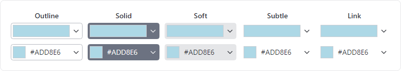

*ColorPicker controls in the default theme with outline, solid, soft, subtle, and link class styles and neutral colors*

- [ColorPicker](xref:@ActiproUIRoot.Themes.ControlThemeKind.ColorPicker) - Default control theme.  Use `theme-outline`, `theme-solid`, `theme-soft`, `theme-subtle`, and `theme-link` style class names for a different appearance.

#### ColorView Type

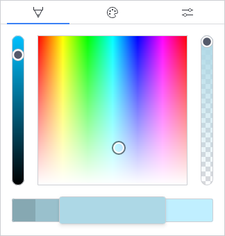

- [ColorView](xref:@ActiproUIRoot.Themes.ControlThemeKind.ColorView) - Default control theme.

#### Other Types

The following default control themes are defined for their respective control types and embedded within the `ColorView` default control theme:

- [ColorPreviewer](xref:@ActiproUIRoot.Themes.ControlThemeKind.ColorPreviewer)
- [ColorSlider](xref:@ActiproUIRoot.Themes.ControlThemeKind.ColorSlider)
- [ColorSpectrum](xref:@ActiproUIRoot.Themes.ControlThemeKind.ColorSpectrum)

## DataGrid Control

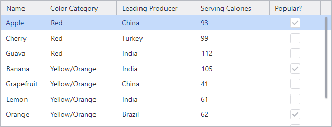

*DataGrid control in the default theme*

The native `DataGrid` control is shipped in its own NuGet package by the Avalonia team and is optional.  When used in your application, a couple extra steps are required to support Actipro themes for the control.

### Configuring

First, a reference to the `ActiproSoftware.Controls.Avalonia.Themes.DataGrid` NuGet package must be added to your project.

Then as described in the [Getting Started](getting-started.md) topic, the [ModernTheme.Includes](xref:@ActiproUIRoot.Themes.ModernTheme.Includes) property must specify either the [NativeDataGrid](xref:@ActiproUIRoot.Themes.ThemeStyleIncludes.NativeDataGrid) or [All](xref:@ActiproUIRoot.Themes.ThemeStyleIncludes.All) option, as in the following example.

```xaml
<Application ... xmlns:actipro="http://schemas.actiprosoftware.com/avaloniaui">
	<Application.Styles>
		<actipro:ModernTheme Includes="NativeColorPicker, NativeDataGrid" />
	</Application.Styles>
</Application>
```

### Related Controls

The following default control themes are defined for their respective control types:

- [DataGrid](xref:@ActiproUIRoot.Themes.ControlThemeKind.DataGrid)
- [DataGridCell](xref:@ActiproUIRoot.Themes.ControlThemeKind.DataGridCell)
- [DataGridColumnHeader](xref:@ActiproUIRoot.Themes.ControlThemeKind.DataGridColumnHeader)
- [DataGridRow](xref:@ActiproUIRoot.Themes.ControlThemeKind.DataGridRow)
- [DataGridRowGroupHeader](xref:@ActiproUIRoot.Themes.ControlThemeKind.DataGridRowGroupHeader)
- [DataGridRowHeader](xref:@ActiproUIRoot.Themes.ControlThemeKind.DataGridRowHeader)
