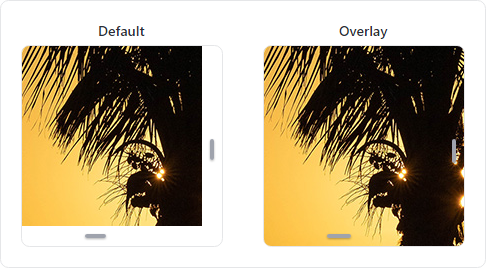

# Scrolling

Actipro's control themes create modern appearances for `ScrollViewer` and `ScrollBar` controls.

## Line Buttons

The default `ScrollViewer` appearance will not show a track or line buttons (used for small increment).


*ScrollBar controls without line buttons (default) and with line buttons*

For individual controls, set the [ThemeProperties](xref:@ActiproUIRoot.Themes.ThemeProperties).[ScrollBarHasLineButtons](xref:@ActiproUIRoot.Themes.ThemeProperties.ScrollBarHasLineButtonsProperty) attached property to `true` to support line buttons.

```xaml
xmlns:actipro="http://schemas.actiprosoftware.com/avaloniaui"
...
<ScrollViewer actipro:ThemeProperties.ScrollBarHasLineButtons="True">
	<!-- Content -->
</ScrollViewer>
```

To globally support line buttons by default, create a custom [Theme Generator](theme-generator.md) and override the [GetBooleanResource](xref:@ActiproUIRoot.Themes.Generation.ThemeGenerator.GetBooleanResource*) method to return `true` for [ThemeResourceKind](xref:@ActiproUIRoot.Themes.ThemeResourceKind).[ScrollBarHasLineButtons](xref:@ActiproUIRoot.Themes.ThemeResourceKind.ScrollBarHasLineButtons) as shown in the following example:

```csharp
public class CustomThemeGenerator : ThemeGenerator {

	protected override bool? GetBooleanResource(ThemeGeneratorSession session, ThemeResourceKind resourceKind) {
		return resourceKind switch {
			// Show line buttons by default
			ThemeResourceKind.ScrollBarHasLineButtons => true,

			_ => base.BooleanResource(session, resourceKind)
		};
	}

}
```

See the [Theme Generator](theme-generator.md) topic for more details.

## Overlay Theme

The default `ScrollViewer` theme will not overlay the content with scrollbars, which avoids potentially obscuring content near the right and bottom edges.  However, a `ScrollViewer` containing an image or spaced-out controls can appear more modern by overlaying the content.



*ScrollViewer controls in the default and overlay control themes*

Add the `theme-scroll-overlay` style class to a `ScrollViewer` to use the overlay theme.

```xaml
<ScrollViewer Classes="theme-scroll-overlay">
	<!-- Content -->
</ScrollViewer>
```