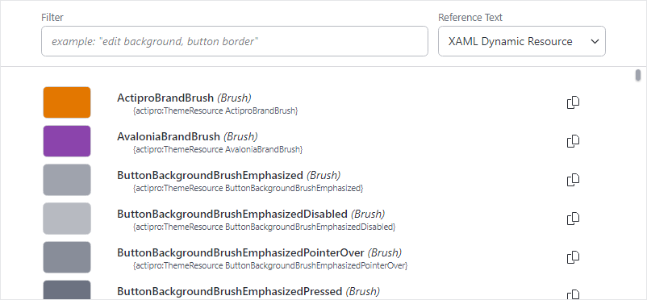

# Theme Assets

Assets are theme resources (brushes, thicknesses, etc.), control themes, and glyphs that are generated or provided as part of Actipro's themes.

While the Actipro control themes rely heavily on these theme assets, assets can also be reused in your own applications.  For instance, reusing theme resources like brushes in custom control themes and throughout the application chrome is necessary to maintain theme consistency across your application's user interface.  Several XAML markup extensions aid in reusing assets with minimal code.

## Theme Resource Browser

The **Theme Resource Browser** utility in the **Themes** section of the **Sample Browser**  application is very helpful for seeing all the resources that are generated by the current Actipro theme definition.



*The Theme Resource Browser*

This utility allows you to quickly find and preview available assets and then copy theme resource references to the clipboard that can be pasted directly into your application.

See the [Theme Resource Browser](../utilities/theme-resource-browser.md) topic for more details.

## Reusing Resources

All theme resources are identified by a value in the [ThemeResourceKind](xref:@ActiproUIRoot.Themes.ThemeResourceKind) enumeration.  The [Theme Generator](theme-generator.md) provides a value for each one of those resources when the application is configured per the [Getting Started](getting-started.md) guide.

There are two ways to easily access theme resources in XAML.

### ThemeResource Markup Extension

[ThemeResourceExtension](xref:@ActiproUIRoot.Markup.Xaml.ThemeResourceExtension) is a markup extension that accepts a [ThemeResourceKind](xref:@ActiproUIRoot.Themes.ThemeResourceKind) value specifying a single resource.  It returns a dynamic resource to that resource value.  Use of a dynamic resource is important when the UI should reflect any changes to the resource value at runtime.

This example shows how to use the markup extension when setting a control's property externally:

```xaml
xmlns:actipro="http://schemas.actiprosoftware.com/avaloniaui"
...
<Border Background="{actipro:ThemeResource Container2BackgroundBrush}">...</Border>
```

And this example shows how to use the markup extension in a `Setter`:

```xaml
xmlns:actipro="http://schemas.actiprosoftware.com/avaloniaui"
...
<Setter Property="Padding" Value="{actipro:ThemeResource MenuItemPadding}" />
```

The examples above, if either of those theme resource values is altered, the target property will be updated since a dynamic resource is in place.

### ThemeResourceKey Markup Extension

Dynamic resource references don't work in some rare scenarios.  An example is when specifying a `ColumnDefinition.MinWidth` property value.  In these cases, a special [ThemeResourceKeyExtension](xref:@ActiproUIRoot.Markup.Xaml.ThemeResourceKeyExtension) markup extension can be used instead to obtain the resource key, and it can be referenced statically with a static resource.

```xaml
xmlns:actipro="http://schemas.actiprosoftware.com/avaloniaui"
...
<ColumnDefinition MinWidth="{StaticResource	{actipro:ThemeResourceKey MenuItemIconColumnWidth}}"
	Width="Auto" SharedSizeGroup="MenuItemIconColumnGroup" />
```

### Defining Resources Based on Actipro Resources

While Actipro provides full themes for all native Avalonia controls, third-party controls often define their own resources, such as brushes.  For example, assume a third-party `SomeControl` is being used in the application, and it defines a brush resource with key `SomeControlBackgroundBrush`.  It is ideal to reuse Actipro's theme resources so that the entire application has a cohesive appearance, especially when switching between light and dark themes.

This example shows how the `SomeControlBackgroundBrush` brush resource can be defined in `Application.Resources` to be based on an appropriate related Actipro theme background brush.  The `SomeControlBackgroundBrush` brush value will dynamically change as the referenced Actipro brush changes.

```xaml
xmlns:actipro="http://schemas.actiprosoftware.com/avaloniaui"
...
<Application.Resources>
    <DynamicResource x:Key="SomeControlBackgroundBrush" ResourceKey="{actipro:ThemeResourceKey Container3BackgroundBrush}" />
</Application.Resources>
```

## Reusing Control Themes

All Actipro's control themes are identified by a value in the [ControlThemeKind](xref:@ActiproUIRoot.Themes.ControlThemeKind) enumeration.

> [!IMPORTANT]
> The [ControlThemeKind](xref:@ActiproUIRoot.Themes.ControlThemeKind) enumeration includes values for all control themes used in any of Actipro's assemblies.  Therefore, some control themes might not be available unless you reference all of the Actipro [NuGet packages](../nuget.md) and set the [ModernTheme.Includes](xref:@ActiproUIRoot.Themes.ModernTheme.Includes) property to [All](xref:@ActiproUIRoot.Themes.ThemeStyleIncludes.All) as indicated in the [Getting Started](getting-started.md) topic.

There are several ways to reference Actipro control themes.

### Style Class Names

Actipro's themes include many style class names that when specified, can invoke a certain control theme.

This example shows how a button can have its [ButtonSolid](xref:@ActiproUIRoot.Themes.ControlThemeKind.ButtonSolid) control theme applied by using the `theme-solid` style class name.

```xaml
<Button Classes="theme-solid" Content="Solid Button" />
```

> [!TIP]
> See the [Native Control Themes](native-control-themes.md) topic for a list of all available native control themes and the style class names that can invoke them.

### ControlTheme Markup Extension

[ControlThemeExtension](xref:@ActiproUIRoot.Markup.Xaml.ControlThemeExtension) is a markup extension that accepts a [ControlThemeKind](xref:@ActiproUIRoot.Themes.ControlThemeKind) value specifying a single control theme.  It returns a static resource to that control theme value.

The markup extension can be used in a control's `Theme` property like:

```xaml
xmlns:actipro="http://schemas.actiprosoftware.com/avaloniaui"
...
<Button Theme="{actipro:ControlTheme ButtonSolid}" Content="Solid Button" />
```

When a custom control class based on `Button` should have a `Solid` control theme, it can reference the control theme like this:

```xaml
xmlns:actipro="http://schemas.actiprosoftware.com/avaloniaui"
...
<Button Theme="{actipro:ControlTheme ButtonSolid}" Content="Solid Button" />
```

### ControlThemeKey Markup Extension

The [ControlThemeKeyExtension](xref:@ActiproUIRoot.Markup.Xaml.ControlThemeKeyExtension) markup extension can be used instead to obtain the resource key, and it can be referenced statically with a static resource.  This is effectively the same as using [ControlThemeExtension](xref:@ActiproUIRoot.Markup.Xaml.ControlThemeExtension) and is more verbose. The following example demonstrates setting the control theme for a custom `MyButton` class that derives from `Button` and will be based on the "solid" button theme.

```xaml
xmlns:actipro="http://schemas.actiprosoftware.com/avaloniaui"
mlxns:myControls="using:MyApplication.MyControls"
...
<ControlTheme TargetType="myControls:MyButton" BasedOn="{actipro:ControlTheme ButtonSolid}">
	<Setter Property="Padding" Value="10" />
	...
</ControlTheme>
```

## Reusing Glyphs

Actipro's themes include many built-in `DataTemplate`-based glyphs that can be reused.  The [GlyphTemplateKind](xref:@ActiproUIRoot.Themes.GlyphTemplateKind) enumeration has a value for each glyph.  The names of the enumeration values are a description followed by a number.  Since all glyphs are square sized, the number indicates the width and height of the glyph.

There are two ways to easily access glyph resources in XAML.

### GlyphTemplate Markup Extension

[GlyphTemplateExtension](xref:@ActiproUIRoot.Markup.Xaml.GlyphTemplateExtension) is a markup extension that accepts a [GlyphTemplateKind](xref:@ActiproUIRoot.Themes.GlyphTemplateKind) value specifying a single resource.  It returns a dynamic resource to that resource value.

This example shows how to use the markup extension when setting a `DataTemplate`-based property externally to a 16x16 **Clear** icon:

```xaml
xmlns:actipro="http://schemas.actiprosoftware.com/avaloniaui"
...
<ContentPresenter ContentTemplate="{actipro:GlyphTemplate Clear16}" />
```

### GlyphTemplateKey Markup Extension

The [GlyphTemplateKeyExtension](xref:@ActiproUIRoot.Markup.Xaml.GlyphTemplateKeyExtension) markup extension can be used to obtain the glyph resource key, and it can be referenced statically with a static resource.  This way is more verbose than using [GlyphTemplateExtension](xref:@ActiproUIRoot.Markup.Xaml.GlyphTemplateExtension).

```xaml
xmlns:actipro="http://schemas.actiprosoftware.com/avaloniaui"
...
<ContentPresenter ContentTemplate="{StaticResource {actipro:GlyphTemplateKey Clear16}}" />
```

## Overriding Assets

In some cases, you may wish to override an asset from its generated or provided Actipro theme value.  An alternate value can be inserted in `Application.Resources` or any other element's `Resources`, and the alternate value should take precedence over the Actipro theme value.

The following example shows how to override the default button foreground brush to `Red` application-wide.

```xaml
<Application ... xmlns:actipro="http://schemas.actiprosoftware.com/avaloniaui">
	<Application.Resources>
		<ResourceDictionary>

			<SolidColorBrush x:Key="{actipro:ThemeResourceKey ButtonForegroundBrush}" Color="Red" />

		</ResourceDictionary>
	</Application.Resources>
</Application>
```

## Resource Keys in Code

All of Actipro's theme assets are stored as standard resources, so they can be accessed just like any other resource as long as you use the proper key.

[ThemeResourceKind](xref:@ActiproUIRoot.Themes.ThemeResourceKind), [ControlThemeKind](xref:@ActiproUIRoot.Themes.ControlThemeKind), and [GlyphTemplateKind](xref:@ActiproUIRoot.Themes.GlyphTemplateKind) all have a `ToResourceKey` extension method (e.g., `ThemeResourceKind`.[ToResourceKey](xref:@ActiproUIRoot.Themes.ResourceKeyExtensions.ToResourceKey*)) that will return the proper key to be used for that asset's resource.

The following demonstrates one way to lookup a theme resource at the application level for the current theme:

```csharp
Application.Current?.TryGetResource(
	ThemeResourceKind.ControlBackgroundBrushEmphasizedAccent.ToResourceKey(),
	Application.Current?.ActualThemeVariant ?? ThemeVariant.Light,
	out var resource);
```

Since applications can change themes, however, it is more common, especially with theme resources, to bind an asset as a dynamic resource so a change in theme will also update the binding. The following example shows a `Border` control configured in code to bind its `Background` property to an Actipro theme resource:

```csharp
var border = new Border();
border.Bind(Border.BackgroundProperty, border.GetResourceObservable(ThemeResourceKind.Container1BackgroundBrush.ToResourceKey()));
```

> [!NOTE]
> The `ActiproSoftware.UI.Avalonia.Themes` namespace must be imported to use the `ToResourceKey` extension methods.