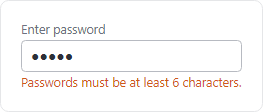
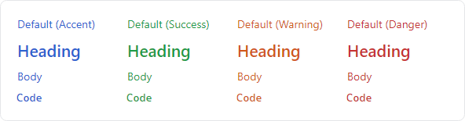

# Typography

Numerous style classes are available that can render `TextBlock`, `SelectableTextBlock`, and `Label` controls in various ways.

## Document Themes

`TextBlock`, `SelectableTextBlock`, and `Label` controls support "heading", "body", and "code" control themes with different relative font sizes.

### Font Sizing

All themes have a default font size (medium), but an explicit size can be set using one of following style class names:

- `size-xs` - An extra-small font size.
- `size-sm` - A small font size.
- `size-md` - A normal font size (default).
- `size-lg` - A large font size.
- `size-xl` - An extra-large font size.

### Heading Ramp

Use the `theme-text-heading` style class to render a word-wrapped heading that defaults to the medium size.


*TextBlock with "heading" theme shown in font sizes from extra-large to extra-small*

The following example demonstrates how the `theme-text-heading` style class name can be combined with various sizes:

```xaml
<!-- 'theme-text-heading' uses 'size-md' by default -->
<TextBlock Classes="theme-text-heading size-xl" Text="Extra Large Heading" />
<TextBlock Classes="theme-text-heading size-lg" Text="Large Heading" />
<TextBlock Classes="theme-text-heading" Text="Medium Heading" />
<TextBlock Classes="theme-text-heading size-sm" Text="Small Heading" />
<TextBlock Classes="theme-text-heading size-xs" Text="Extra Small Heading" />
```

### Body Ramp

Use the `theme-text-body` style class to render word-wrapped document body text that defaults to the medium size.


*TextBlock with "body" theme shown in font sizes from extra-large to extra-small*

The following example demonstrates how the `theme-text-body` style class name can be combined with various sizes:

```xaml
<!-- 'theme-text-body' uses 'size-md' by default -->
<TextBlock Classes="theme-text-body size-xl" Text="Extra large body text" />
<TextBlock Classes="theme-text-body size-lg" Text="Large body text" />
<TextBlock Classes="theme-text-body" Text="Medium body text" />
<TextBlock Classes="theme-text-body size-sm" Text="Small body text" />
<TextBlock Classes="theme-text-body size-xs" Text="Extra small body text" />
```

### Code Ramp

Use the `theme-text-code` style class to render code text that defaults to the medium size.


*TextBlock with "code" theme shown in font sizes from extra-large to extra-small*

The following example demonstrates how the `theme-text-code` style class name can be combined with various sizes:

```xaml
<!-- 'theme-text-code' uses 'size-md' by default -->
<TextBlock Classes="theme-text-code size-xl" Text="Extra large code text" />
<TextBlock Classes="theme-text-code size-lg" Text="Large code text" />
<TextBlock Classes="theme-text-code" Text="Medium code text" />
<TextBlock Classes="theme-text-code size-sm" Text="Small code text" />
<TextBlock Classes="theme-text-code size-xs" Text="Extra small code text" />
```


## Form Themes

Additional "label" and "message" themes are available which are designed for typical use on data input forms.



*TextBlock controls showing "label" theme (above) and "message" theme (below) with warning variant combined with an edit control*

The following example demonstrates how the `theme-form-control-label` and `theme-form-control-message` style class names can be used:

```xaml
xmlns:actipro="http://schemas.actiprosoftware.com/avaloniaui"
...
<StackPanel>
	<TextBlock Classes="theme-form-control-label" Text="Enter password" />
	<TextBox PasswordChar="{actipro:ThemeResource EditPasswordChar}" Text="password" />
	<TextBlock Classes="theme-form-control-message warning" Text="Passwords must be at least 6 characters." />
</StackPanel>
```

## Foreground Brushes

There are several built-in text foreground brushes that can be used for different levels of emphasis.


*TextBlock controls showing different light theme variant foreground brushes*

Each foreground brush is available as a theme resource.

| Theme Resource | Description |
|-----|-----|
| [DefaultForegroundBrushMax](xref:@ActiproUIRoot.Themes.ThemeResourceKind.DefaultForegroundBrushMax) | Maximum contrast foreground brush. |
| [DefaultForegroundBrush](xref:@ActiproUIRoot.Themes.ThemeResourceKind.DefaultForegroundBrush) | Normal foreground brush. |
| [DefaultForegroundBrushSecondary](xref:@ActiproUIRoot.Themes.ThemeResourceKind.DefaultForegroundBrushSecondary) | Secondary foreground brush. |
| [DefaultForegroundBrushTertiary](xref:@ActiproUIRoot.Themes.ThemeResourceKind.DefaultForegroundBrushTertiary) | Tertiary foreground brush. |
| [DefaultForegroundBrushDisabled](xref:@ActiproUIRoot.Themes.ThemeResourceKind.DefaultForegroundBrushDisabled) | Disabled foreground brush. |

The following example demonstrates using the secondary foreground brush:

```xaml
xmlns:actipro="http://schemas.actiprosoftware.com/avaloniaui"
...
<TextBlock Foreground="{actipro:ThemeResource DefaultForegroundBrushSecondary}" Text="Actipro Themes" />
```

> [!TIP]
> Pure black text on a white background (or white text on a black background) may result in more eye strain, so the "Normal" foreground brush, with less contrast, is recommended for most scenarios instead of the "Maximum Contrast" brush.

## Semantic Variants

There are several built-in semantic color variants for text which can draw attention to meaningful text.



*TextBlock controls in the default, heading, body, and code themes showing light theme semantic color variants*

The semantic variants can be applied to any `TextBlock`, `SelectableTextBlock`, or `Label` using the following style class names:
- `accent` - The accent semantic variant uses the theme's accent color, and is generally appropriate for something action-oriented.
- `success` - The success semantic variant indicates a positive result.
- `warning` - The warning semantic variant tells an end user to be careful.
- `danger` - The danger semantic variant indicates a negative result, or warns the end user to be very careful.

The following example demonstrates how the "heading" theme can be combined with the available semantic color variant style class names:

```xaml
<TextBlock Classes="theme-text-heading accent" Content="Accent" />
<TextBlock Classes="theme-text-heading success" Content="Success" />
<TextBlock Classes="theme-text-heading warning" Content="Warning" />
<TextBlock Classes="theme-text-heading danger" Content="Danger" />
```

