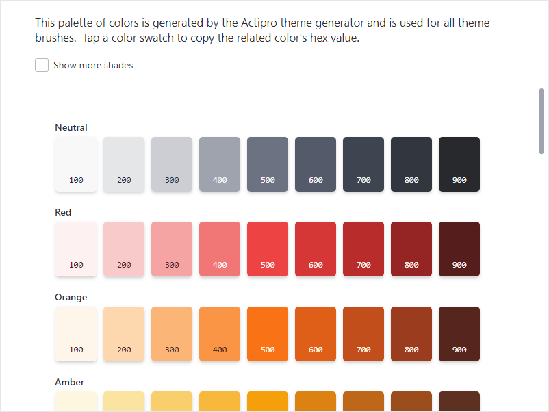

# Color Palette

The **Color Palette** is a utility that displays a palette of colors generated by the Actipro theme generator that is used for all theme brushes.

It is available from the **View** menu within the **Sample Browser**'s title bar or from the **Utilities** category of the **Themes** product.

*The Color Palette showing multiples shades from different color ramps*

## Using the Color Palette

By default, a limited number of shades are displayed for each color family. Check the **Show more shades** option to display a wider range of shades.

Tap or click any color swatch to copy the related color's hex value to the clipboard.