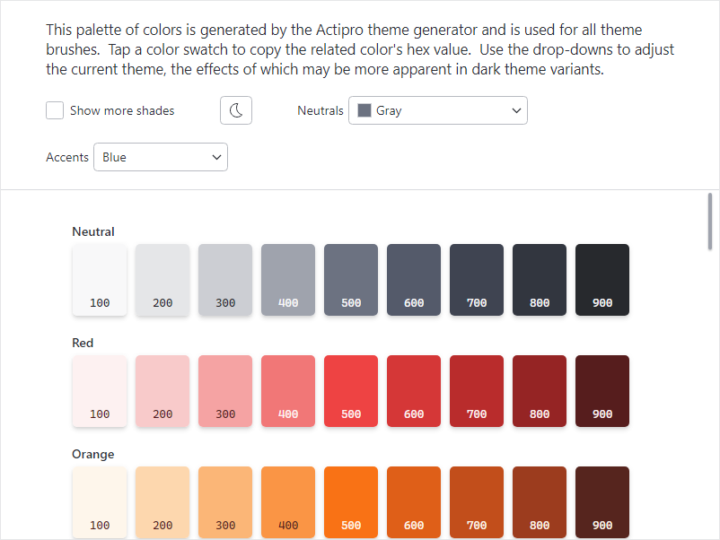

# Color Palette

The **Color Palette** is a utility that displays a palette of colors generated by the Actipro theme generator that is used for all theme brushes.

It is available from the **View** menu within the **Sample Browser**'s title bar or from the **Utilities** category of the **Themes** product.

*The Color Palette showing multiples shades from different color ramps*

## Using the Color Palette

By default, a limited number of shades are displayed for each color family. Check the **Show more shades** option to display a wider range of shades.

Tap or click any color swatch to copy the related color's hex value to the clipboard.

## Adjusting Neutrals

Use the **Neutrals** drop-down to adjust the neutral midtone color in the color palette factory, as described in the [Theme Generator](../themes/theme-generator.md) topic.  Changes to this neutral midtone color will tint a majority of a theme, since 80-90% of a user interface uses neutral colors.  The effects of changing the neutral midtone color are more apparent in dark theme variants.

## Adjusting Accent Color Hue

Use the **Accents** drop-down to select the [Hue](xref:@ActiproUIRoot.Themes.Generation.Hue) of the color ramp that will render accents in the theme, such as for selected item backgrounds.