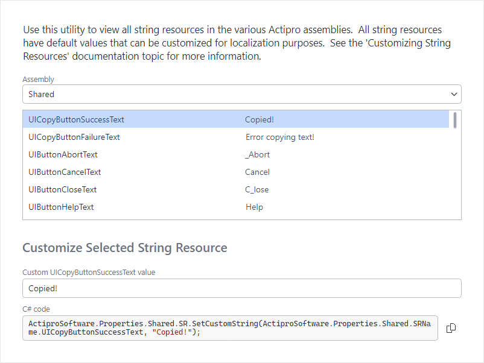

# String Resource Browser

The **String Resource Browser** allows you to view all the string resources that are defined for the various Actipro Avalonia control products.  It can also generate code to customize or localize any of the string resources in our products.

It is available from the **View** menu within the **Sample Browser**'s title bar.



*The String Resource Browser*

## Using the String Resource Browser

Simply select the desired assembly in the **Assembly** drop-down to view the string resources for products in that assembly.

The list of resources shows each resource name and its default value.

## Customizing String Resources

You may wish to change the default text to your own text, and in many other cases, you may simply wish to create localized versions of our default text.

The **String Resource Browser** can create C# statements that override our default text for a specific string resource.  To do this, select the target string resource in the list, enter some customized text, and click the **Copy** button to copy the code to the clipboard.

The copied value looks like this:

```csharp
ActiproSoftware.Properties.Shared.SR.SetCustomString(ActiproSoftware.Properties.Shared.SRName.UITextBoxButtonShowPasswordText, "Show Password");
```

> [!IMPORTANT]
> You should paste this code in your application startup so that it is run before any user interface has been loaded.

See the [Customizing String Resources](../customizing-string-resources.md) topic for additional details.