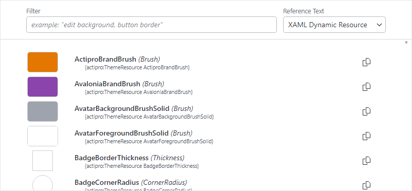

# Theme Resource Browser

The **Theme Resource Browser** is a helpful utility that displays all the theme resources generated by the current Actipro theme definition

It is available from the **View** menu within the **Sample Browser**'s title bar or from the **Utilities** category of the **Themes** product.



*The Theme Resource Browser*

> [!TIP]
>See the [Themes](../themes/index.md) topic for more information on working with themes.

## Using the Theme Resource Browser

The browser can be used to scroll through all the available theme resources (brushes, thicknesses, etc.) that are defined in the current theme.  These asset resources are used throughout the styles and templates for Actipro's control products, as well as for Actipro's native Avalonia UI control themes.  By reusing these resources, developers can create a consistent user interface that can universally adapt to changes in the theme.

The browser's list of resources consists of several columns:
- **Resource Preview** - A representation of the resource's value.  For instance, in the case of a `Brush` resource, a brush swatch is displayed.
- **Kind and Type** - The [ThemeResourceKind](xref:@ActiproUIRoot.Themes.ThemeResourceKind) value identifying the resource and its .NET `Type`.
- **Resource Reference** - XAML extension syntax for a resource reference that will create a `DynamicResource` binding.
- **Copy Button** - When clicked, copies the related theme resource reference to the clipboard (see "Reusing Resources in Your Application" section below).

### Filtering

Use the **Filter** textbox above the list to narrow down the displayed resources.  Within the filter, spaces are treated as wildcards and commas can be used to distinguish separate filters. For instance, a filter of `edit background, button border` would be the equivalent of filtering for `edit*background or button*border` and would match these resources and others:

- `ButtonBorderBrush`
- `ButtonBorderBrushPressed`
- `EditBackgroundBrush`
- `EditBackgroundBrushDisabled`
- `EditSelectionBackgroundBrush`


### Reusing Resources in Your Application

If you would like to reuse a certain theme resource in your own application, a **Copy** button is available next to each resource in the list.  Tap or click the button and XAML extension syntax for a `DynamicResource` binding will be copied to the clipboard. You can then paste the string into any XAML property value in your application.  That property will then use whatever theme resource value is provided by the current theme.  If you change the theme, then the property value will be updated to the new resource value.

The following example shows how a theme resource could be used to define the border of a `Button` control.

```xaml
xmlns:actipro="http://schemas.actiprosoftware.com/avaloniaui"
...

<Button BorderBrush="{actipro:ThemeResource ButtonBorderBrush}" ... />
```

> [!TIP]
> See the "Reusing Resources" section of the [Theme Assets](../themes/theme-assets.md) topic for more details.