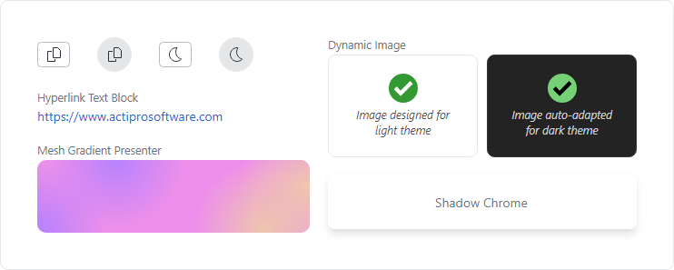

# Actipro Avalonia Controls

 
 

Samples, documentation, and other related open-source projects for [Actipro Avalonia Controls](https://www.actiprosoftware.com/products/controls/avalonia), a set of UI controls, components, and themes for building beautiful multi-platform Avalonia applications.

| Light Theme Variant | Dark Theme Variant |
| ------------- | ------------- |
|  |  |

## Table of Contents

- [Actipro Avalonia Pro Products](#actipro-avalonia-pro-products)
- [Actipro Avalonia Free Products](#actipro-avalonia-free-products)
- [Getting Started](#getting-started)
  - [Download and Run Samples](#download-and-run-samples)
  - [Review Product Documentation](#review-product-documentation)
  - [Evaluate in Your Apps](#evaluate-in-your-apps)
- [Supported Technologies](#supported-technologies)
- [Branches](#branches)
- [Contributing](#contributing)
- [Support](#support)
- [Licensing](#licensing)

## Actipro Avalonia Pro Products

Elevate your application by licensing professionally designed commercial controls and getting access to the XAML source for all of our default control styles and themes.

[Actipro Bars](https://www.actiprosoftware.com/docs/controls/avalonia/bars/index) contains everything you need to implement advanced Office-like ribbon, toolbar, and menu functionality in your Avalonia applications.  Multiple ribbon layout modes, variant sizing, content-rich galleries, screen tips, key tips, backstage, and MVVM support are all included.

[Actipro Docking &amp; MDI](https://www.actiprosoftware.com/docs/controls/avalonia/docking/index) is a complete solution for easily adding a docking tool window and/or multiple document interface to your applications, with many features found in popular IDEs.

[Actipro Fundamentals](https://www.actiprosoftware.com/docs/controls/avalonia/fundamentals/index) provides a collection of advanced controls that are useful for many different types of applications, including settings configuration controls, user prompts, message boxes, info bars, avatars, badges, segmented bars, progress spinners, and more.

## Actipro Avalonia Free Products

Several Actipro products are **freely available** for anyone to use in their applications, providing a strong foundation for building high-quality applications.

[Actipro Themes](https://www.actiprosoftware.com/docs/controls/avalonia/themes/index) ensures that a great consistent visual appearance is applied to all controls within your application, regardless of whether they are Actipro Avalonia control products or native Avalonia controls.

The [Actipro Shared Library](https://www.actiprosoftware.com/docs/controls/avalonia/shared/index) is a common control library referenced by all our Actipro Avalonia controls. It contains several very useful controls, components, value converters, and utilities that can be used in your projects.

The [Actipro Core Library](https://www.actiprosoftware.com/docs/controls/avalonia/core/index) is a class library that is completely UI framework agnostic. It contains numerous helpful utilities and base classes that can be used in your .NET projects.

## Getting Started

### Download and Run Samples

The Sample Browser application allows you to examine all of the Actipro Avalonia controls, themes, and their feature sets via hundreds of examples.  Its full source code is contained in this repo's `Samples\SampleBrowser` folder.

Follow these steps to download and run the application:

- Clone or download this repository.
- Open the `Samples\SampleBrowser\SampleBrowser.Desktop.sln` solution in Visual Studio.
- Build and run the solution's application project.

### Review Product Documentation

Complete [product documentation](https://www.actiprosoftware.com/docs/controls/avalonia/index) including an API reference is available on our web site.

The Markdown source code for the product documentation is contained within this repo's `Documentation\topics` folder.  The documentation is built with [DocFx](https://github.com/dotnet/docfx). 

### Evaluate in Your Apps

[Packages for the Actipro Avalonia Controls](https://www.nuget.org/packages?q=ActiproSoftware.Controls.Avalonia) are published on nuget.org, all beginning with the `ActiproSoftware.Controls.Avalonia` name prefix.  References to the packages can be added to your own Avalonia application projects to evaluate and use them.  See our [NuGet Packages and Feeds](https://www.actiprosoftware.com/docs/controls/avalonia/nuget) documentation topic for more detail.

#### Minimum NuGet Packages

One of these NuGet packages must be referenced at a minimum to use our products:

- [ActiproSoftware.Controls.Avalonia](https://www.nuget.org/packages/ActiproSoftware.Controls.Avalonia) - Contains all of the Actipro Avalonia Free product assemblies, which can be used at no cost.
- [ActiproSoftware.Controls.Avalonia.Pro](https://www.nuget.org/packages/ActiproSoftware.Controls.Avalonia.Pro) - Contains all of the Actipro Avalonia Pro product assemblies, and is for customers who have licensed the Actipro Avalonia Pro controls.  Also includes the `ActiproSoftware.Controls.Avalonia` NuGet package as a dependency.

#### Optional NuGet Packages

This NuGet package is for customers who have licensed the Actipro Avalonia Pro controls:

- [ActiproSoftware.Controls.Avalonia.Bars.Mvvm](https://www.nuget.org/packages/ActiproSoftware.Controls.Avalonia.Bars.Mvvm) - Free classes and themes that support using the MVVM (Model-View-ViewModel) pattern with the Actipro Bars product.

These two NuGet packages can be referenced if you wish to use Actipro's themes for the native `ColorPicker` and/or `DataGrid` controls that complement other Actipro Avalonia control themes:

- [ActiproSoftware.Controls.Avalonia.Themes.ColorPicker](https://www.nuget.org/packages/ActiproSoftware.Controls.Avalonia.Themes.ColorPicker) - Free themes for the native Avalonia `ColorPicker` control.
- [ActiproSoftware.Controls.Avalonia.Themes.DataGrid](https://www.nuget.org/packages/ActiproSoftware.Controls.Avalonia.Themes.DataGrid) - Free themes for the native Avalonia `DataGrid` control.

## Supported Technologies

- **Frameworks:** .NET 6+
- **Architectures:** Any CPU, ARM64, x64, and x86
- **Platforms:** Windows, macOS, Linux, WASM (Browser), and more *
- **IDEs:** All IDEs supported by Avalonia

\* *Some features or functionality may be limited or unavailable on non-desktop platforms.*

## Branches

This repository has two primary branches:

- [main](https://github.com/Actipro/Avalonia-Controls/tree/main) - The codebase for official production-ready releases.
- [develop](https://github.com/Actipro/Avalonia-Controls/tree/develop) - Contains work-in-progress code, which may include pre-release logic that is not ready for production usage.

When cloning this repository for samples of our official releases, it's best to use the [main](https://github.com/Actipro/Avalonia-Controls/tree/main) branch.

## Contributing

We welcome contributions to our open-source repository.  If you want to submit a pull request, please first open a [GitHub issue](https://github.com/Actipro/Avalonia-Controls/issues) or [contact us](https://www.actiprosoftware.com/company/contact) to discuss.

Read through our [How to Contribute](https://github.com/Actipro/.github/blob/main/Contributing.md) document, as it covers everything you need to know about contributing.

## Support

Our [Support](https://github.com/Actipro/.github/blob/main/Support.md) document provides details about how to properly obtain support for both our closed-source UI control products and for code in this open-source repo (documentation and samples).  This chart shows a quick summary:

| | UI Control Products | Open-Source Repos |
| --- | :-: | :-: |
| [Contact us via support options](https://www.actiprosoftware.com/company/contact) | ✔ | ✔ |
| [Create a GitHub issue](https://github.com/Actipro/Avalonia-Controls/issues) | ❌ | ✔ |

## Licensing

While the source code in this repo falls under the terms of the [included license document](https://github.com/Actipro/Avalonia-Controls/blob/develop/License.md), the Actipro End-User License Agreement (EULA) applies to usage of our commercial Avalonia control products.  

The [Licensing](https://www.actiprosoftware.com/docs/controls/avalonia/licensing) documentation topic discusses product licensing in detail.

Visit the [Actipro purchasing page](https://www.actiprosoftware.com/purchase) to order developer licenses for the Pro controls.  [Contact our sales team](https://www.actiprosoftware.com/company/contact) if you have any questions.
